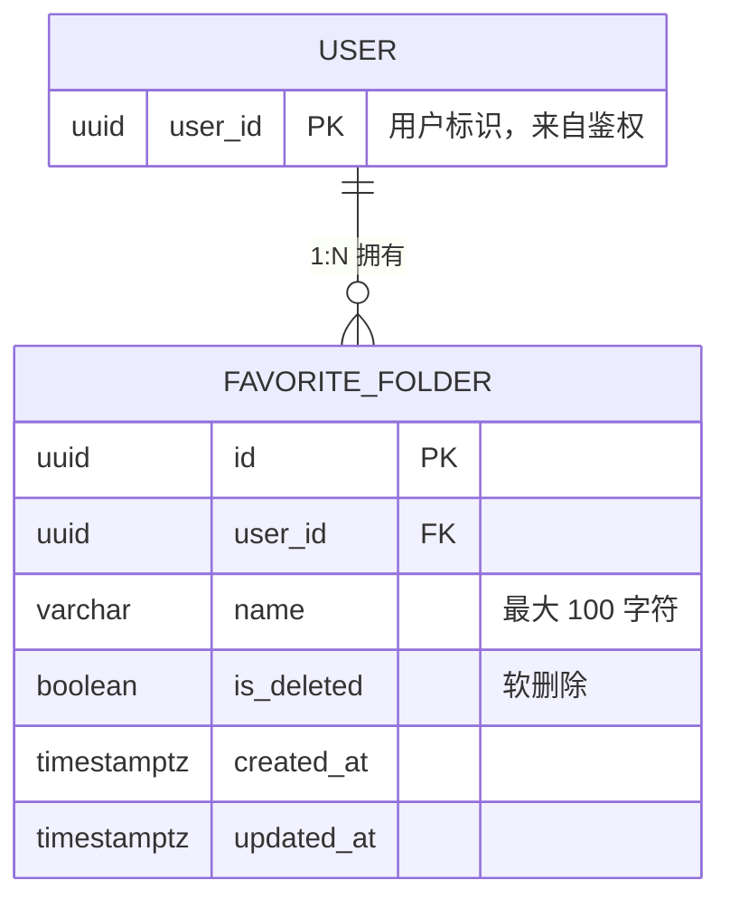
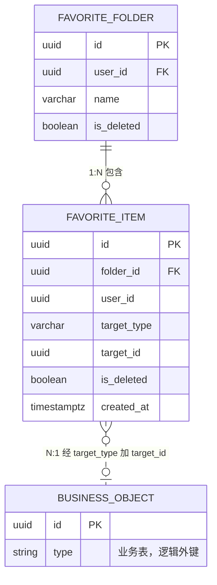
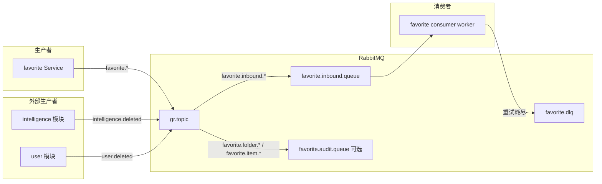
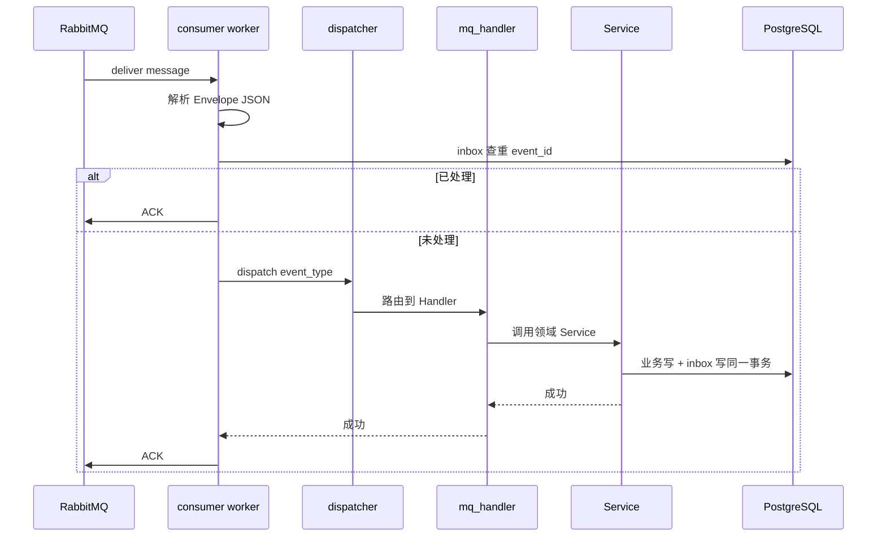

# 收藏夹模块设计文档

> **项目**：griver_favorites（独立新项目）  
> **架构参考**：DogeX GoldRiver 分层规范  
> **版本**：v1.2  
> **日期**：2026-07-28  
> **状态**：评审通过（v1.2 补充 RabbitMQ 异步消息模型）

---

## 1. 文档目的

本文档描述收藏夹（Favorite）模块的数据模型、API、分层架构、异常与日志规范、RabbitMQ 异步消息模型，以及本期实现范围与后续扩展方向。编码前须通过设计评审。

**关联文档**：[api.md](./api.md)（接口清单，错误码与本文档 §8 保持一致）

---

## 2. 背景与目标

### 2.1 业务背景

用户需要将情报等内容收藏到自定义收藏夹中管理。若每种业务（文章、商品、视频等）各建一张收藏表，维护成本极高。企业级常见做法是 **通用收藏表 + target_type 区分业务对象**。

### 2.2 设计原则

- **通用收藏关系（后续）**：`favorite_item` 表通过 `target_type + target_id` 逻辑指向任意业务对象，不建跨库物理外键
- **收藏夹与元素 1:N（后续）**：一个收藏夹包含多条 `favorite_item`；每条 item 指向一个业务对象
- **用户级收藏去重（后续，当前产品倾向）**：同一用户对同一 `(target_type, target_id)` 全局只允许一条未删除记录（即同一对象不能同时出现在两个收藏夹）；若产品改为「同一对象可进多个收藏夹」，见 §3.3 约束变更说明
- **分层规范**：严格遵循 Gold River 架构（Router → Service → Repository），Session 由 Router 注入
- **YAGNI**：本期只做收藏夹本体 CRUD；添加/移除/移动、缓存、MQ 均不在本期范围

### 2.3 本期范围（强制）

| 功能 | 本期 |
|------|------|
| 收藏夹创建 | 是 |
| 收藏夹分页列表 | 是 |
| 收藏夹关键词搜索 | 是 |
| 收藏夹详情查询 | 是 |
| 收藏夹重命名 | 是 |
| 收藏夹软删除 | 是 |
| 软删后同名新建 | 是 |
| 添加/移除/移动情报 | 否，预留表结构与常量 |
| Cache-Aside 缓存 | 否 |
| RabbitMQ 生产者（操作审计事件） | 否，见 §13 |
| RabbitMQ 消费者（业务对象生命周期） | 否，见 §13 |

### 2.4 非功能需求（本期）

| 项 | 约定 |
|----|------|
| 单用户收藏夹数量 | 暂不设上限；若后续需限流，在 Service 层扩展 |
| 列表接口数据量 | 依赖分页；单页默认 10、最大 100（见 §4.3） |
| 时区 | 数据库存 TIMESTAMPTZ；API 出参统一 ISO 8601 UTC（带 +00:00 或 Z） |
| 鉴权 | 所有接口须登录；未登录由框架层处理，见 §7.2 |

---

## 3. 数据模型

### 3.1 实体关系

#### 3.1.1 本期 ER（仅 folder CRUD）

本期实现与 `favorite_item`、业务对象均无关联，API 只操作 `favorite_folder`。



#### 3.1.2 扩展 ER（item 能力上线后）

`favorite_item` 本期可建表但不暴露 API。`BUSINESS_OBJECT` 为逻辑实体，表示 intelligence 等业务模块中的表，不在本库建物理外键。



说明：

- 虚线表示跨模块逻辑关联，非数据库 FK
- 多条 `favorite_item` 可指向同一业务对象（不同用户各自收藏）
- 当前唯一约束下，同一用户同一对象仅一条 item（见 §3.3）

### 3.2 表：favorite_folder（本期实现）

| 字段 | 类型 | 约束 | 说明 |
|------|------|------|------|
| id | UUID | PK | 主键，建议 uuid7 |
| user_id | UUID | NOT NULL | 所属用户，来自鉴权，不信任请求体 |
| name | VARCHAR(100) | NOT NULL | 收藏夹名称，按 Unicode 字符计，最大 100 |
| is_deleted | BOOLEAN | NOT NULL, DEFAULT false | 软删除标记 |
| created_at | TIMESTAMPTZ | NOT NULL | 创建时间（UTC） |
| updated_at | TIMESTAMPTZ | NOT NULL | 更新时间（UTC） |

**索引与约束**：

```sql
CREATE UNIQUE INDEX uq_favorite_folder_user_name_active
    ON favorite_folder (user_id, name)
    WHERE is_deleted = false;

CREATE INDEX idx_favorite_folder_user_list
    ON favorite_folder (user_id, is_deleted, updated_at DESC);
```

**命名规则**：

| 规则 | 说明 |
|------|------|
| 长度计量 | 按 Python len(str) 即 Unicode 码点计，非字节；emoji 计 1 字符 |
| 最大长度 | 100 字符 |
| 首尾空格 | 入库前 strip；strip 后长度须 ≥ 1 |
| 中间空格 | 允许连续空格，不做额外压缩 |
| 大小写 | 重名校验**区分大小写**（My 与 my 视为不同名） |
| 重名 | 同用户下，未删除的收藏夹不可重名 |
| 软删后同名 | 允许新建同名收藏夹（新 id） |
| 重命名为原名 | 允许，幂等成功，仍更新 updated_at |

**并发**：同用户并发创建同名收藏夹时，唯一索引可能触发 DB IntegrityError；Service 层须捕获并转换为 `FavoriteFolderNameDuplicateException`（见 §8.4）。

### 3.3 表：favorite_item（预留扩展，本期不实现 API）

| 字段 | 类型 | 约束 | 说明 |
|------|------|------|------|
| id | UUID | PK | 主键 |
| folder_id | UUID | NOT NULL | 逻辑外键 → favorite_folder.id |
| user_id | UUID | NOT NULL | 冗余，便于按用户约束与查询 |
| target_type | VARCHAR(50) | NOT NULL | 收藏对象类型，见 TargetType |
| target_id | UUID | NOT NULL | 收藏对象 ID |
| is_deleted | BOOLEAN | NOT NULL, DEFAULT false | 软删除 |
| created_at | TIMESTAMPTZ | NOT NULL | 收藏时间 |

**预留约束（后续「添加收藏」任务启用）**：

```sql
CREATE UNIQUE INDEX uq_favorite_item_user_target_active
    ON favorite_item (user_id, target_type, target_id)
    WHERE is_deleted = false;

CREATE INDEX idx_favorite_item_folder
    ON favorite_item (folder_id, is_deleted);
```

**约束变更说明**：若产品改为「同一对象可进多个收藏夹」，将唯一约束改为 `(folder_id, target_type, target_id) WHERE is_deleted = false`，并同步更新 §2.2 与 §11。

**软删 folder 对 item 的策略（预留，item 上线前须最终确认）**：

| 策略 | 说明 | 当前倾向 |
|------|------|----------|
| 级联软删 | folder 软删时，其下未删 item 一并 is_deleted=true | **采用** |
| 保留 orphan | item 保留，folder 不可见 | 不采用 |
| 禁止删除非空 folder | folder 内有 item 时不允许软删 | 不采用 |

本期无 item API，folder 软删逻辑按上表「级联软删」预留：在 `delete_favorite_folder` 中一并软删关联 item（item 表存在且有数据时生效）。

### 3.4 类型枚举 TargetType

定义于 `apps/favorite/common/constants.py`，本期仅声明，业务不使用：

| 值 | 说明 | 状态 |
|----|------|------|
| intelligence | 情报 | 预留 |
| （其他） | 实体、文章等 | 后续按需扩展 |

### 3.5 数据库与迁移

| 项 | 约定 |
|----|------|
| 迁移工具 | Alembic（与 GoldRiver 主项目一致） |
| 迁移目录 | `migrations/versions/`（随项目初始化创建） |
| 本期建表 | `favorite_folder` 必须；`favorite_item` 可与 folder 同批 migration 建表但不写业务逻辑 |
| Schema | 默认 `public`；若宿主项目有 schema 前缀，跟随宿主 settings |
| 连接配置 | 通过宿主 `.env` / settings 注入 `DATABASE_URL`，本模块不单独维护连接池 |
| 回滚 | 每个 migration 须提供 downgrade；本期至少包含 folder 表及索引 |

---

## 4. API 设计

**路由前缀**：`/grapi/v1/favorite`  
**模块注册**：`apps/favorite/__init__.py` → `on_init = routers.router`

### 4.1 接口总览

| # | 方法 | 路径 | 名称 | 鉴权 | 成功 HTTP |
|---|------|------|------|------|-----------|
| 1 | POST | /folders | 创建收藏夹 | verify=True | 201 |
| 2 | GET | /folders | 分页列表 + 搜索 | verify=True | 200 |
| 3 | GET | /folders/{folder_id} | 收藏夹详情 | verify=True | 200 |
| 4 | PATCH | /folders/{folder_id} | 重命名 | verify=True | 200 |
| 5 | DELETE | /folders/{folder_id} | 软删除 | verify=True | 200 |

与 GoldRiver 其他模块对齐：业务错误统一 HTTP 200 + 非 0 code；鉴权失败由框架返回，见 §7.2。

### 4.2 创建收藏夹

**POST /grapi/v1/favorite/folders**

请求体：

```json
{
  "name": "我的情报收藏"
}
```

| 字段 | 类型 | 必填 | 校验 |
|------|------|------|------|
| name | string | 是 | strip 后 1~100 字符 |

响应 data（HTTP 201）：

```json
{
  "id": "019fa2ff-xxxx-xxxx-xxxx-xxxxxxxxxxxx",
  "name": "我的情报收藏",
  "created_at": "2026-07-27T12:00:00+00:00",
  "updated_at": "2026-07-27T12:00:00+00:00"
}
```

业务规则：

- user_id 从 request.user_id 获取
- 同用户未删除重名 → FavoriteFolderNameDuplicateException

### 4.3 分页列表 + 搜索

**GET /grapi/v1/favorite/folders**

查询参数：

| 参数 | 类型 | 默认 | 说明 |
|------|------|------|------|
| page | int | 1 | 页码；小于 1 时按 1 处理 |
| page_size / size | int | 10 | 每页条数；见下表 |
| keyword | string | 可选 | 对 name 模糊匹配 ILIKE |

**分页边界**（写入 settings，键名建议与 relation 模块一致）：

| 配置项 | 值 | 说明 |
|--------|-----|------|
| 默认值 | 10 | page_size 缺省 |
| 最小值 | 1 | 小于 1 钳制为 1 |
| 最大值 | 100 | 超过则钳制为 100 |
| 参数优先级 | size 优先于 page_size | 两者同时出现时以 size 为准 |

**keyword 规则**：

| 情况 | 行为 |
|------|------|
| 未传 keyword | 不过滤名称 |
| 空字符串或仅空白 | 视为未传，不过滤 |
| 含 % 或 _ | 使用参数化查询并对通配符转义，避免 ILIKE 误匹配 |
| 超长 keyword | 截断至 100 字符后搜索（与 name 最大长度一致） |

响应 data（PaginatedResponse）：

```json
{
  "items": [
    {
      "id": "...",
      "name": "我的情报收藏",
      "created_at": "...",
      "updated_at": "..."
    }
  ],
  "total": 1,
  "page": 1,
  "page_size": 10
}
```

业务规则：

- 仅返回 user_id = 当前用户 且 is_deleted = false
- 默认排序：updated_at DESC
- 不含收藏元素数量（后续扩展 item_count）
- page 超出总页数时返回空 items，total 仍为真实总数

### 4.4 收藏夹详情

**GET /grapi/v1/favorite/folders/{folder_id}**

路径参数 folder_id 须为合法 UUID。非法 UUID 由框架校验层返回 422（与 GoldRiver 全局行为一致，见 §7.3）。

响应 data：

```json
{
  "id": "...",
  "name": "我的情报收藏",
  "created_at": "...",
  "updated_at": "..."
}
```

业务规则：

- 必须属于当前用户且 is_deleted = false
- 不存在 / 已软删 / 非本人 → 统一 FavoriteFolderNotFoundException（不泄露是否存在）

后续扩展：在此接口增加 items 或 item_count 字段，路由不变。

### 4.5 重命名

**PATCH /grapi/v1/favorite/folders/{folder_id}**

请求体：

```json
{
  "name": "新名称"
}
```

| 字段 | 类型 | 必填 | 说明 |
|------|------|------|------|
| name | string | 是 | 必填；校验同创建 |

响应：**固定返回更新后的完整 folder 对象**（与创建出参结构相同，HTTP 200）。不采用空 data。

业务规则：

- 名称校验同 §3.2
- 不能与其他未删除收藏夹重名；与当前名称相同视为成功（幂等）
- 更新 updated_at

### 4.6 软删除

**DELETE /grapi/v1/favorite/folders/{folder_id}**

响应（HTTP 200）：

```json
{
  "code": 0,
  "msg": "success",
  "data": {}
}
```

业务规则：

- 设置 is_deleted = true，更新 updated_at
- 不物理删除
- 软删后释放名称，允许同名新建
- 关联 favorite_item 级联软删（§3.3，item 表有数据时生效）

---

## 5. 工程结构

```
apps/favorite/
├── __init__.py
├── models.py
├── exceptions.py
├── common/
│   ├── constants.py
│   └── mq_constants.py          # Exchange / RoutingKey 常量（§13）
├── schemas/
│   ├── folder.py
│   └── mq_events.py             # 消息体 Pydantic Schema（§13）
├── repositories/
│   ├── folder.py
│   └── mq_inbox.py              # 消费幂等 inbox 表（§13.6）
├── services/
│   ├── folder.py
│   └── mq_handlers/             # 按 event_type 分文件的 Handler（§13.5）
│       ├── intelligence_deleted.py
│       └── user_deleted.py
├── publishers/
│   └── favorite_events.py       # 领域事件发布（§13.4）
├── consumers/
│   ├── worker.py                  # Consumer 进程入口
│   └── dispatcher.py            # 路由 event_type → Handler
└── routers/folder.py

migrations/
└── versions/

tests/
├── unit/favorite/test_folder_service.py
├── unit/favorite/test_mq_handlers.py
└── integration/favorite/test_folder_router.py
```

---

## 6. 分层职责与 Session 传递

参照 Gold River `apps/relation/` 标准链路。

```
Depends(get_db_session())
  → Routers：注入 session，调用 Service，返回 APIResponse
  → Services：业务校验、commit、抛异常
  → Repositories：执行 SQL，接收 session，不 commit、不创建 session
```

### 6.1 Repository 函数命名

| 函数 | 职责 |
|------|------|
| favorite_folder_create | 构造 ORM 对象 |
| favorite_folder_find_by_id_and_user | 按 id + user_id 查未删记录 |
| favorite_folder_list_by_user | 分页 + keyword 列表 |
| favorite_folder_count_by_name | 同用户未删重名检查 |
| favorite_folder_update_name | 更新 name / updated_at |
| favorite_folder_soft_delete | 设置 is_deleted；预留级联 item |

### 6.2 Service 函数命名

| 函数 | 职责 |
|------|------|
| create_favorite_folder | 创建 + 重名校验 + commit |
| list_favorite_folders | 分页列表 |
| get_favorite_folder_detail | 详情 + 归属校验 |
| rename_favorite_folder | 重命名 + commit |
| delete_favorite_folder | 软删 + commit |

### 6.3 Schema 命名

| 类型 | 名称 |
|------|------|
| 创建入参 | FavoriteFolderCreateInSchema |
| 更新入参 | FavoriteFolderUpdateInSchema |
| 列表查询 | FavoriteFolderListQueryParams |
| 出参 | FavoriteFolderOutSchema |

---

## 7. 统一响应与 HTTP 约定

### 7.1 成功与业务失败

成功响应：

```json
{
  "code": 0,
  "msg": "success",
  "data": {}
}
```

业务失败：HTTP 200，code 非 0，msg 为可读说明，data 为空对象或省略。

分页：Service 返回 PaginatedResponse，Router 包 APIResponse(data=...)。

### 7.2 鉴权失败

由 `request_init(verify=True)` 在框架层处理，本模块 Router 不重复校验。

| 场景 | HTTP | 说明 |
|------|------|------|
| 未登录 / token 无效 / 过期 | 401 | 与 GoldRiver 全局鉴权一致 |
| 已登录但无权限 | 403 | 本期不涉及；预留 |

### 7.3 参数校验失败

| 场景 | HTTP | 说明 |
|------|------|------|
| folder_id 非合法 UUID | 422 | FastAPI 路径参数校验 |
| 请求体字段缺失或类型错误 | 422 | Pydantic 校验 |
| page / page_size 非整数 | 422 | Query 校验 |

### 7.4 HTTP 状态码汇总

| 接口 | 成功 | 业务错误 | 鉴权 | 参数错误 |
|------|------|----------|------|----------|
| POST /folders | 201 | 200 | 401 | 422 |
| GET /folders | 200 | 200 | 401 | 422 |
| GET /folders/{id} | 200 | 200 | 401 | 422 |
| PATCH /folders/{id} | 200 | 200 | 401 | 422 |
| DELETE /folders/{id} | 200 | 200 | 401 | 422 |

---

## 8. 异常设计

### 8.1 异常类与错误码

| 异常类 | code 常量 | 对外 code 字符串 | 触发场景 |
|--------|-----------|------------------|----------|
| FavoriteFolderNotFoundException | CODE_FAVORITE_FOLDER_NOT_EXISTS | FAVORITE_FOLDER_NOT_EXISTS | 不存在、已软删或非本人 |
| FavoriteFolderNameDuplicateException | CODE_FAVORITE_FOLDER_NAME_DUPLICATE | FAVORITE_FOLDER_NAME_DUPLICATE | 创建/重命名重名 |
| FavoriteFolderNameInvalidException | CODE_FAVORITE_FOLDER_NAME_INVALID | FAVORITE_FOLDER_NAME_INVALID | 空名、超 100 字符 |

对外 code 字符串用于 API 响应 msg 或框架映射；实现时与 GoldRiver 异常基类对齐具体 numeric code。

### 8.2 业务错误响应示例

收藏夹不存在：

```json
{
  "code": 404001,
  "msg": "FAVORITE_FOLDER_NOT_EXISTS",
  "data": {}
}
```

名称重复：

```json
{
  "code": 409001,
  "msg": "FAVORITE_FOLDER_NAME_DUPLICATE",
  "data": {}
}
```

名称非法：

```json
{
  "code": 400001,
  "msg": "FAVORITE_FOLDER_NAME_INVALID",
  "data": {}
}
```

说明：numeric code 具体数值在实现阶段向 GoldRiver 错误码段申请后回填；文档以字符串标识为准，api.md 与之同步。

### 8.3 异常处理职责

- Services 层抛出业务异常
- Routers 层不 try-catch 业务异常
- 框架统一将异常映射为 HTTP 200 + 非 0 code

### 8.4 并发与数据库异常

创建或重命名时若触发唯一索引冲突（IntegrityError），Service 须捕获并转换为 FavoriteFolderNameDuplicateException，不向客户端暴露原始 DB 错误。

---

## 9. 日志规范

| 级别 | 场景 | 关键字段 |
|------|------|----------|
| INFO | 创建 / 重命名 / 软删成功 | user_id, folder_id, name |
| WARNING | 业务异常（NotFound / Duplicate / Invalid） | user_id, folder_id（若有）, reason |
| DEBUG | 列表 / 详情查询 | 默认不开启；必要时 user_id, page |

Routers 层不写业务日志。列表与详情成功路径不打 INFO，避免刷量。

**结构化示例**（一行 JSON）：

```json
{"level":"INFO","event":"favorite_folder_created","user_id":"...","folder_id":"...","name":"..."}
```

---

## 10. 测试设计（TDD）

### 10.1 功能用例

| # | 用例 | 预期 |
|---|------|------|
| 1 | 创建成功 | 返回 folder，HTTP 201 |
| 2 | 创建空名 / 超 100 | NameInvalid |
| 3 | 创建重名 | Duplicate |
| 4 | 列表分页 | total / items 正确 |
| 5 | keyword 搜索 | 命中 / 未命中 |
| 6 | keyword 空串 / 空白 | 等同未传 |
| 7 | keyword 含 % | 不误匹配 |
| 8 | 详情成功 | 返回 folder |
| 9 | 详情不存在 / 已软删 / 非本人 | NotFound |
| 10 | folder_id 非法 UUID | 422 |
| 11 | 重命名成功 | 返回更新后对象 |
| 12 | 重命名重名 | Duplicate |
| 13 | 重命名为原名 | 成功，updated_at 更新 |
| 14 | 软删成功 | 列表不可见 |
| 15 | 软删后同名新建 | 成功，新 id |
| 16 | page=0 | 按 page=1 处理 |
| 17 | page_size 超 100 | 钳制为 100 |
| 18 | 并发创建重名 | 一个成功，其余 Duplicate |

### 10.2 测试环境约定

| 项 | 约定 |
|----|------|
| 单元测试 | mock Repository 或内存 DB；覆盖 Service 校验与异常 |
| 集成测试 | 使用测试库 + 事务回滚或独立 schema；HTTP 层 mock request_init 注入固定 user_id |
| 鉴权 | 集成测试须覆盖未登录 → 401（框架行为） |
| 数据隔离 | 每个用例使用独立 user_id 或清理 favorite_folder |

---

## 11. 后续扩展（本期不实现）

### 11.1 API 扩展

| 能力 | 扩展方式 |
|------|----------|
| 添加情报 | POST /folders/{folder_id}/items |
| 移除收藏 | DELETE /items/{item_id} |
| 移动收藏 | PUT /items/{item_id}/move |
| 缓存 | 后续任务；触发条件：单用户 item 量或 QPS 达阈值时再评估 |
| RabbitMQ | 见 §13；与 item API 同期或稍后上线 |

### 11.2 跨模块职责（item 上线时）

| 职责 | 负责方 |
|------|--------|
| 存储收藏关系 | 本模块 favorite_item |
| 校验 target_id 是否存在 | **添加收藏时**由本模块调用对应业务服务（如 intelligence）校验；不存在则拒绝 |
| 展示收藏内容详情 | 调用方或 BFF 按 target_type 批量拉取业务对象；本模块列表接口可只返回 target 引用 |
| 业务对象被删除 | 业务模块发布 MQ 事件，本模块 Consumer 级联软删 item（§13.5）；定时清理作兜底 |
| 收藏数统计 | 业务侧如需「被 N 人收藏」，按 target_type + target_id 查 favorite_item |

### 11.3 API 版本策略

破坏性变更走 `/grapi/v2/favorite`；v1 只做 additive 字段（如 item_count）。

---

## 12. GoldRiver 集成

| 项 | 说明 |
|----|------|
| 依赖 | 作为 GoldRiver monorepo 子模块或 pip 依赖宿主框架；具体包名与版本随宿主 requirements 锁定 |
| 注册 | apps/favorite/__init__.py 导出 on_init = routers.router；宿主 main 扫描 apps 自动挂载 |
| 鉴权 | Depends(request_init(verify=True))；user_id 从 request.user_id |
| Session | Depends(get_db_session()) |
| 响应 | APIResponse、PaginatedResponse 来自宿主 common 包 |
| 参考实现 | apps/relation/ 分层与命名 |
| 本地开发 | 跟随宿主 docker-compose 起 PostgreSQL；执行 alembic upgrade head；pytest tests/ |
| 健康检查 | 本模块不单独暴露；沿用宿主 /health |
| RabbitMQ | 连接与 Channel 池由宿主 common/mq 提供；本模块只定义 Exchange、Queue、RoutingKey 与 Handler |

---

## 13. RabbitMQ 异步消息模型

本章描述收藏夹模块的消息生产与消费设计。**本期不实现**；建议在 **item API 上线同期或稍后** 启用，与 §11.2 跨模块职责配合。

### 13.1 目标与边界

| 方向 | 用途 | 是否阻塞 API 主路径 |
|------|------|---------------------|
| **Producer（出站）** | folder / item 写操作成功后，发布领域审计事件，供日志、BI、下游订阅 | 否；发布失败仅打 ERROR 日志，不回滚 DB 事务 |
| **Consumer（入站）** | 订阅业务模块生命周期事件，级联维护 favorite_item 一致性 | 是（异步）；与 API 解耦 |

不在 MQ 中传递收藏夹全量快照；消息体只含事件类型、主键与必要上下文，详情由消费方按需回查 DB 或业务 API。

### 13.2 拓扑与命名

采用 **Topic Exchange**，与 GoldRiver 全局 MQ 命名对齐。



**命名约定**：

| 资源 | 名称 | 说明 |
|------|------|------|
| Exchange | gr.topic | 宿主级 Topic Exchange，各模块共用 |
| 入站 Queue | favorite.inbound.queue | 本模块消费外部 + 内部需异步处理的事件 |
| 入站 Binding | favorite.inbound.# | 绑定 routing key 前缀 |
| 审计 Queue（可选） | favorite.audit.queue | 专供日志/BI 消费本模块发出的审计事件 |
| 死信 Exchange | gr.dlx | 宿主级 DLX |
| 死信 Queue | favorite.dlq | 本模块死信队列 |

**Routing Key 规范**：{模块}.{资源}.{动作}，全小写，点号分隔。

### 13.3 消息信封（Envelope）

所有消息统一外层结构，payload 按 event_type 解析。

```json
{
  "event_id": "019fa2ff-xxxx-xxxx-xxxx-xxxxxxxxxxxx",
  "event_type": "favorite.folder.created",
  "schema_version": 1,
  "occurred_at": "2026-07-28T02:30:00+00:00",
  "producer": "griver_favorites",
  "trace_id": "optional-trace-id",
  "payload": {}
}
```

| 字段 | 类型 | 必填 | 说明 |
|------|------|------|------|
| event_id | UUID | 是 | 全局唯一，消费幂等键 |
| event_type | string | 是 | 见 §13.4 / §13.5 |
| schema_version | int | 是 | 当前固定 1；破坏性变更递增 |
| occurred_at | ISO8601 UTC | 是 | 事件发生时间 |
| producer | string | 是 | 固定 griver_favorites 或来源模块名 |
| trace_id | string | 否 | 链路追踪，与 HTTP 请求对齐 |
| payload | object | 是 | 事件体，见下表 |

**AMQP 属性建议**：

| 属性 | 值 |
|------|-----|
| content_type | application/json |
| delivery_mode | 2（持久化） |
| message_id | 同 event_id |
| type | 同 event_type |
| timestamp | occurred_at Unix 秒 |

### 13.4 出站事件（Producer）

写操作 **DB commit 成功后** 异步发布；Router 层不直接发消息，由 Service 调用 `publishers/favorite_events.py`。

#### 13.4.1 事件清单

| event_type | 触发时机 | payload 字段 |
|------------|----------|--------------|
| favorite.folder.created | 创建收藏夹成功 | user_id, folder_id, name |
| favorite.folder.renamed | 重命名成功 | user_id, folder_id, old_name, new_name |
| favorite.folder.deleted | 软删成功 | user_id, folder_id, name |
| favorite.item.added | 添加收藏成功（后续） | user_id, folder_id, item_id, target_type, target_id |
| favorite.item.removed | 移除收藏成功（后续） | user_id, item_id, target_type, target_id |
| favorite.item.moved | 移动收藏成功（后续） | user_id, item_id, from_folder_id, to_folder_id, target_type, target_id |

#### 13.4.2 发布示例

favorite.folder.created：

```json
{
  "event_id": "019fa2ff-aaaa-bbbb-cccc-dddddddddddd",
  "event_type": "favorite.folder.created",
  "schema_version": 1,
  "occurred_at": "2026-07-28T02:30:00+00:00",
  "producer": "griver_favorites",
  "trace_id": "abc123",
  "payload": {
    "user_id": "019fa2ff-user-xxxx-xxxx-xxxxxxxxxxxx",
    "folder_id": "019fa2ff-fold-xxxx-xxxx-xxxxxxxxxxxx",
    "name": "我的情报收藏"
  }
}
```

#### 13.4.3 发布失败策略

| 情况 | 处理 |
|------|------|
| 发布超时 / 连接失败 | 记录 ERROR 日志（含 event_id、event_type、payload 摘要）；**不回滚**已 commit 的 DB 事务 |
| 本地暂不可达 | 可选：写入 outbox 表由后台重投（见 §13.8）；本期可不实现 outbox，仅日志 |

审计类事件允许丢失；若后续 BI 强一致，再启用 Transactional Outbox。

### 13.5 入站事件（Consumer）

独立 **Consumer Worker 进程** 消费 `favorite.inbound.queue`，与 FastAPI HTTP 进程分离部署。



#### 13.5.1 订阅事件清单

| event_type | 来源模块 | 本模块动作 |
|------------|----------|------------|
| intelligence.deleted | intelligence | 按 target_type=intelligence + target_id 级联软删 favorite_item |
| user.deleted | user / auth | 按 user_id 级联软删该用户全部 favorite_folder 与 favorite_item |
| intelligence.restored（可选） | intelligence | 不自动恢复 item；仅记 INFO，避免误恢复 |

Binding 示例（favorite.inbound.queue）：

| routing key | 说明 |
|-------------|------|
| intelligence.deleted | 情报硬删或软删终态 |
| user.deleted | 用户注销 |

#### 13.5.2 Handler 职责划分

| 组件 | 职责 |
|------|------|
| consumers/worker.py | 连接 MQ、prefetch、收消息、ACK/NACK、顶层异常 |
| consumers/dispatcher.py | event_type → Handler 映射表 |
| services/mq_handlers/*.py | 单事件业务逻辑；调用 Repository + Service；不含 AMQP 代码 |
| repositories/mq_inbox.py | 幂等 inbox 读写 |

Handler 内 **必须** 通过 `get_db_session` 等价方式获取 Session，与 HTTP 链路共用 Service / Repository，不重复写 SQL。

#### 13.5.3 入站 payload 示例

intelligence.deleted：

```json
{
  "event_id": "019fa2ff-bbbb-bbbb-bbbb-bbbbbbbbbbbb",
  "event_type": "intelligence.deleted",
  "schema_version": 1,
  "occurred_at": "2026-07-28T03:00:00+00:00",
  "producer": "griver_intelligence",
  "payload": {
    "intelligence_id": "019fa2ff-inte-xxxx-xxxx-xxxxxxxxxxxx",
    "deleted_by": "system"
  }
}
```

Handler 映射：target_type = intelligence，target_id = payload.intelligence_id。

user.deleted：

```json
{
  "event_id": "019fa2ff-cccc-cccc-cccc-cccccccccccc",
  "event_type": "user.deleted",
  "schema_version": 1,
  "occurred_at": "2026-07-28T03:00:00+00:00",
  "producer": "griver_user",
  "payload": {
    "user_id": "019fa2ff-user-xxxx-xxxx-xxxxxxxxxxxx"
  }
}
```

### 13.6 消费幂等（Inbox）

表 favorite_mq_inbox，防止 at-least-once 投递导致重复消费。

| 字段 | 类型 | 说明 |
|------|------|------|
| event_id | UUID | PK，同消息 event_id |
| event_type | VARCHAR(100) | NOT NULL |
| processed_at | TIMESTAMPTZ | NOT NULL |
| handler | VARCHAR(100) | 处理函数名，便于排查 |

**处理流程**：

1. 开启事务
2. SELECT event_id FROM favorite_mq_inbox WHERE event_id = ? FOR UPDATE
3. 若存在 → commit 后直接 ACK（幂等跳过）
4. 若不存在 → 执行业务 Handler → INSERT inbox → commit → ACK

业务写与 inbox 写入 **同一事务**；Handler 失败则 rollback，消息 NACK 重试。

### 13.7 可靠性：重试、NACK 与 DLQ

| 项 | 约定 |
|----|------|
| QoS prefetch | 10（可配置）；单 Consumer 实例内顺序处理 |
| 可重试错误 | DB 短暂不可用、连接池超时、下游 RPC 超时 |
| 不可重试错误 | JSON 解析失败、schema_version 不支持、payload 缺字段、未知 event_type（无 Handler） |
| 重试方式 | NACK requeue=true，配合队列 TTL + DLX；或宿主统一的延迟重试队列 |
| 最大重试 | 3 次 |
| 死信 | 进入 favorite.dlq；人工排查或脚本补偿 |

| 错误类型 | ACK | NACK requeue | 进 DLQ |
|----------|-----|--------------|--------|
| 幂等重复 | 是 | - | - |
| 业务成功 | 是 | - | - |
| 可重试失败 | - | 是（≤3 次） | 超过后 |
| 不可重试 | - | - | 是 |

未知 event_type：记录 WARNING 后直接 ACK，避免毒消息阻塞队列（与宿主 convention 对齐后可改为 DLQ）。

### 13.8 Transactional Outbox（可选，后续）

若要求 **DB 与 MQ 强一致**，增加 favorite_outbox 表：

| 字段 | 说明 |
|------|------|
| id | PK |
| event_id | 唯一 |
| event_type | |
| payload | JSONB |
| status | pending / sent / failed |
| created_at | |

流程：Service commit 时同事务写 outbox；独立 outbox relay 进程扫描 pending 发布到 gr.topic。本期 **不实现**；Producer 采用 §13.4.3 最佳努力发布即可。

### 13.9 配置项

| 配置键 | 示例 | 说明 |
|--------|------|------|
| RABBITMQ_URL | amqp://guest@localhost:5672/ | 宿主统一 |
| FAVORITE_MQ_ENABLED | false | 总开关；本期 false |
| FAVORITE_MQ_PREFETCH | 10 | Consumer prefetch |
| FAVORITE_MQ_MAX_RETRIES | 3 | 重试上限 |
| FAVORITE_MQ_INBOUND_QUEUE | favorite.inbound.queue | |
| FAVORITE_MQ_DLQ | favorite.dlq | |

### 13.10 日志与监控

| 级别 | 场景 | 关键字段 |
|------|------|----------|
| INFO | 消费成功 | event_id, event_type, duration_ms |
| INFO | 幂等跳过 | event_id, event_type |
| WARNING | 未知 event_type | event_id, event_type, raw_routing_key |
| ERROR | Handler 失败 | event_id, event_type, error, retry_count |
| ERROR | 发布失败 | event_id, event_type |

监控指标（接入宿主 Prometheus 时）：

| 指标 | 说明 |
|------|------|
| favorite_mq_consume_total | 按 event_type、status 计数 |
| favorite_mq_consume_duration_seconds | Handler 耗时 |
| favorite_mq_publish_total | 出站发布计数 |
| favorite_mq_dlq_depth | DLQ 堆积深度 |

### 13.11 测试设计

| # | 用例 | 预期 |
|---|------|------|
| 1 | intelligence.deleted 正常消费 | 关联 item is_deleted=true |
| 2 | 重复 event_id | 幂等 ACK，不重复软删 |
| 3 | 不存在的 target_id | 成功 ACK，影响行数 0 |
| 4 | user.deleted | folder + item 全部软删 |
| 5 | 畸形 JSON | 不可重试，进 DLQ 或 ACK+日志（与 §13.7 策略一致） |
| 6 | schema_version=999 | 不可重试 |
| 7 | Producer 发布失败 | DB 已 commit，仅 ERROR 日志 |
| 8 | Handler DB 异常 | NACK 重试，最终 DLQ |

单元测试 mock Repository；集成测试使用 RabbitMQ 测试容器或宿主 testcontainers fixture。

### 13.12 上线阶段

| 阶段 | 内容 |
|------|------|
| Phase 0（本期） | 不启 MQ；代码目录可预留 |
| Phase 1 | 启用 Consumer：intelligence.deleted、user.deleted |
| Phase 2 | 启用 Producer：folder 审计事件 |
| Phase 3 | item 事件 + 可选 outbox |

---

## 14. 设计评审记录

| 日期 | 议题 | 结论 |
|------|------|------|
| 2026-07-27 | 通用表 vs 分表 | target_type + target_id |
| 2026-07-27 | 本期范围 | 仅 folder CRUD + 查询 |
| 2026-07-27 | 详情接口 | 必须实现 |
| 2026-07-27 | 名称长度 | 100 Unicode 字符 |
| 2026-07-27 | 软删后同名 | 允许 |
| 2026-07-28 | 收藏夹与元素关系 | 1:N，非多对多；用户级去重 |
| 2026-07-28 | ER 图 | 拆为本期 / 扩展两图 |
| 2026-07-28 | 重命名响应 | 固定返回更新后对象 |
| 2026-07-28 | 软删 folder | 级联软删 item（预留） |
| 2026-07-28 | 创建 HTTP 状态 | 201 |
| 2026-07-28 | 错误码 | 统一字符串标识，见 §8 |
| 2026-07-28 | RabbitMQ | Topic Exchange + 独立 Consumer Worker；出站审计、入站级联；inbox 幂等 |

**评审状态**：v1.2 已定稿

---

## 15. 文档变更记录

| 版本 | 日期 | 变更摘要 |
|------|------|----------|
| v1.0 | 2026-07-27 | 初版：folder CRUD、预留 item |
| v1.1 | 2026-07-28 | 修正 1:N 表述；拆分 ER；补边界条件、错误码、HTTP 约定、迁移、集成、测试与跨模块职责 |
| v1.2 | 2026-07-28 | 新增 §13 RabbitMQ 异步消息模型：拓扑、信封、Producer/Consumer、幂等 inbox、重试 DLQ、测试与分阶段上线 |
