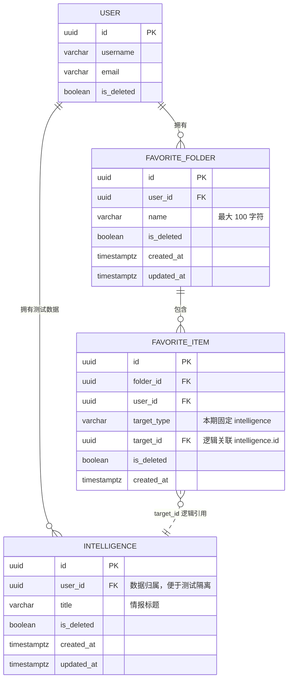

# 收藏夹模块设计文档

> **项目**：griver_favorites  
> **架构参考**：Router → Service → Repository 分层  
> **版本**：v2.0  
> **日期**：2026-07-28  
> **状态**：按作业需求定稿（v2.0 对齐完整功能范围，不含登录/MQ/前端）

**关联文档**：[api.md](./api.md)（接口清单，错误码与本文档 §8 保持一致）

---

## 1. 文档目的

本文档描述收藏夹与收藏关系的数据模型、业务规则、API、分层架构、异常与测试设计，作为编码与 TDD 的唯一依据。

---

## 2. 背景与目标

### 2.1 业务背景

运营人员需要把**已有情报**整理到不同收藏夹中，方便后续查看和分类管理。

- 系统已存在情报基础数据；情报表**只供收藏与查询引用**。
- **本项目不实现**情报的新增、修改、删除。
- 须提供**可重复执行**的测试数据初始化方式（用户、情报、收藏夹、收藏关系）。
- **本项目不实现**：登录、权限、消息队列、前端页面。

### 2.2 功能范围（全部本期实现）

| # | 功能 | 本期 |
|---|------|------|
| 1 | 创建、查询、重命名、软删除收藏夹 | 是 |
| 2 | 分页查询收藏夹，支持按名称搜索 | 是 |
| 3 | 查询收藏夹详情及其**情报数量** | 是 |
| 4 | 将指定情报加入收藏夹 | 是 |
| 5 | 将情报从收藏夹移除 | 是 |
| 6 | 将情报从一个收藏夹移动到另一个收藏夹 | 是 |
| 7 | 分页查询收藏夹内的情报 | 是 |
| 8 | 按情报**标题**筛选收藏内容 | 是 |
| 9 | 同一情报允许出现在**不同**收藏夹 | 是 |
| 10 | 删除收藏夹不删除原始情报数据 | 是 |

**明确不在本期**：登录鉴权、权限、RabbitMQ、Redis 缓存、前端。

### 2.3 业务规则（强制）

| # | 规则 |
|---|------|
| R1 | 有效收藏夹名称不能重复；名称须 **strip 首尾空格** 后再校验 |
| R2 | 同一情报**不能重复加入同一个收藏夹** |
| R3 | 已删除的收藏夹不能查询、修改或继续添加情报 |
| R4 | 不存在或已删除的情报不能加入收藏夹 |
| R5 | 移动前必须校验**来源收藏夹确实包含**该情报 |
| R6 | **目标收藏夹已包含**该情报时，移动操作失败 |
| R7 | 移动操作必须在**同一事务**中完成，任一步失败全部回滚 |
| R8 | 删除收藏夹时同步处理有效收藏关系（级联软删 item），**不修改原始情报** |
| R9 | 并发重复收藏时，数据库层必须保证最终只有一条有效关系 |
| R10 | 所有异常须转换为**稳定的业务错误码**，禁止向客户端暴露原始数据库错误 |

### 2.4 设计原则

- **收藏夹与收藏关系 1:N**：一个收藏夹包含多条 `favorite_item`；每条 item 通过 `target_type + target_id` 指向情报。
- **跨收藏夹允许重复情报**：同一 `(target_type, target_id)` 可出现在多个收藏夹；**同一收藏夹内**不可重复（R2、R9）。
- **分层规范**：Router → Service → Repository；Session 由 Router 通过 `Depends(get_db_session)` 注入。
- **用户标识**：本项目无登录模块；`user_id` 由 API **请求体或 Query 显式传入**，用于数据隔离与测试。
- **情报只读**：Repository 只查询情报表校验存在性；不提供情报写接口。

### 2.5 非功能需求

| 项 | 约定 |
|----|------|
| 单用户收藏夹数量 | 暂不设上限 |
| 列表分页 | 默认 10，最大 100 |
| 时区 | TIMESTAMPTZ；API 出参 ISO 8601 UTC |
| 测试数据 | `scripts/db/` 提供 idempotent seed，可重复执行 |

---

## 3. 数据模型

### 3.1 实体关系



说明：

- `INTELLIGENCE` 为本项目**只读**测试/引用表；不建跨表物理 FK 到 `favorite_item`，由 Service 校验。
- 同一情报可被多个 folder 收藏；约束在 **folder 维度** 去重（§3.4）。

### 3.2 表：users

本地开发与测试用；`user_id` 由 API 传入，须存在于该表（或 seed 预置）。

| 字段 | 类型 | 约束 | 说明 |
|------|------|------|------|
| id | UUID | PK | |
| username | VARCHAR(64) | NOT NULL, UNIQUE | |
| email | VARCHAR(255) | NOT NULL, UNIQUE | |
| is_deleted | BOOLEAN | DEFAULT false | |
| created_at | TIMESTAMPTZ | NOT NULL | |
| updated_at | TIMESTAMPTZ | NOT NULL | |

### 3.3 表：intelligence（只读引用）

| 字段 | 类型 | 约束 | 说明 |
|------|------|------|------|
| id | UUID | PK | |
| user_id | UUID | NOT NULL | 测试数据归属 |
| title | VARCHAR(255) | NOT NULL | 列表筛选字段（R8） |
| is_deleted | BOOLEAN | DEFAULT false | 已删不可收藏（R4） |
| created_at | TIMESTAMPTZ | NOT NULL | |
| updated_at | TIMESTAMPTZ | NOT NULL | |

**索引建议**：

```sql
CREATE INDEX idx_intelligence_user_active
    ON intelligence (user_id, is_deleted);

CREATE INDEX idx_intelligence_title
    ON intelligence (title);
```

### 3.4 表：griver_favorite_folder

| 字段 | 类型 | 约束 | 说明 |
|------|------|------|------|
| id | UUID | PK | |
| user_id | UUID | NOT NULL, FK → users.id | API 传入 |
| name | VARCHAR(100) | NOT NULL | strip 后 1~100 字符 |
| is_deleted | BOOLEAN | DEFAULT false | |
| created_at | TIMESTAMPTZ | NOT NULL | |
| updated_at | TIMESTAMPTZ | NOT NULL | |

**索引与约束**：

```sql
CREATE UNIQUE INDEX uq_griver_favorite_folder_user_name_active
    ON griver_favorite_folder (user_id, name)
    WHERE is_deleted = false;

CREATE INDEX idx_griver_favorite_folder_user_list
    ON griver_favorite_folder (user_id, is_deleted, updated_at DESC);
```

**命名规则**：同 v1.x——Unicode 计长、区分大小写、strip 后校验、软删后允许同名新建。

### 3.5 表：griver_favorite_item

| 字段 | 类型 | 约束 | 说明 |
|------|------|------|------|
| id | UUID | PK | |
| folder_id | UUID | NOT NULL, FK → griver_favorite_folder.id | |
| user_id | UUID | NOT NULL, FK → users.id | 冗余，便于按用户查询 |
| target_type | VARCHAR(50) | NOT NULL | 本期固定 `intelligence` |
| target_id | UUID | NOT NULL | → intelligence.id |
| is_deleted | BOOLEAN | DEFAULT false | |
| created_at | TIMESTAMPTZ | NOT NULL | |

**索引与约束（对齐 R2、R9）**：

```sql
-- 同一收藏夹内同一情报仅一条有效记录（R2、R9）
CREATE UNIQUE INDEX uq_griver_favorite_item_folder_target_active
    ON griver_favorite_item (folder_id, target_type, target_id)
    WHERE is_deleted = false;

CREATE INDEX idx_griver_favorite_item_folder
    ON griver_favorite_item (folder_id, is_deleted);
```

> **与 v1.x 差异**：不再使用 `(user_id, target_type, target_id)` 唯一索引，否则违反「同一情报可进多个收藏夹」。

**软删 folder（R8）**：folder 软删时，其下未删 item **级联软删**；**不**修改 `intelligence` 表。

### 3.6 类型枚举 TargetType

定义于 `apps/favorite/common/constants.py`：

| 值 | 说明 | 状态 |
|----|------|------|
| intelligence | 情报 | **本期唯一使用** |

### 3.7 数据库与迁移

| 项 | 约定 |
|----|------|
| 迁移工具 | Alembic |
| 迁移目录 | `migrations/versions/` |
| 本期建表 | users、griver_favorite_folder、griver_favorite_item、**intelligence** |
| 连接配置 | `.env` 中 `DATABASE_URL` / `DATABASE_URL_SYNC` |
| Seed | `scripts/db/` 下 SQL，须可重复执行（DELETE 固定 id 段 + INSERT） |

---

## 4. API 设计

**路由前缀**：`/grapi/v1/favorite`  
**模块注册**：`apps/favorite/__init__.py` → `on_init = routers.router`

**用户标识（无登录）**：除纯路径参数外，写操作与按用户隔离的读操作须在 **Body 或 Query** 传 `user_id`（UUID）。详见 [api.md](./api.md)。

### 4.1 接口总览

| # | 方法 | 路径 | 说明 | 成功 HTTP |
|---|------|------|------|-----------|
| 1 | POST | /folders | 创建收藏夹 | 201 |
| 2 | GET | /folders | 分页列表 + 名称搜索 | 200 |
| 3 | GET | /folders/{folder_id} | 详情 + **item_count** | 200 |
| 4 | PATCH | /folders/{folder_id} | 重命名 | 200 |
| 5 | DELETE | /folders/{folder_id} | 软删除（级联 item，不删情报） | 200 |
| 6 | POST | /folders/{folder_id}/items | 加入情报 | 201 |
| 7 | DELETE | /folders/{folder_id}/items/{item_id} | 移除情报 | 200 |
| 8 | PUT | /items/{item_id}/move | 移动到另一收藏夹 | 200 |
| 9 | GET | /folders/{folder_id}/items | 分页列表 + **标题筛选** | 200 |

业务错误：HTTP **200** + 非 0 `code`；参数错误：**422**。

### 4.2 创建收藏夹

**POST /folders**

请求体：

```json
{
  "user_id": "019fa2ff-user-xxxx-xxxx-xxxxxxxxxxxx",
  "name": "  我的情报收藏  "
}
```

| 字段 | 类型 | 必填 | 校验 |
|------|------|------|------|
| user_id | UUID | 是 | 须为有效用户 |
| name | string | 是 | strip 后 1~100 字符 |

响应 data（HTTP 201）：`id, name, created_at, updated_at`

规则：R1；重名 → `FAVORITE_FOLDER_NAME_DUPLICATE`

### 4.3 分页列表 + 搜索

**GET /folders?user_id=&page=1&size=10&keyword=**

| 参数 | 说明 |
|------|------|
| user_id | 必填 |
| page | 默认 1；小于 1 按 1 |
| size / page_size | 默认 10，最大 100；size 优先 |
| keyword | 对 folder.name ILIKE；空/空白视为未传 |

仅返回 `is_deleted = false`。排序 `updated_at DESC`。

### 4.4 收藏夹详情

**GET /folders/{folder_id}?user_id=**

响应 data 增加 **item_count**（未软删 item 数量）：

```json
{
  "id": "...",
  "name": "...",
  "item_count": 3,
  "created_at": "...",
  "updated_at": "..."
}
```

规则：R3；不存在/已软删/非本人 → `FAVORITE_FOLDER_NOT_EXISTS`

### 4.5 重命名 / 软删除

同 v1.x 语义；请求须带 `user_id`（Query 或 Body，与 api.md 一致）。

软删除：R3、R8——folder 与下属 item 软删，**intelligence 不变**。

### 4.6 加入情报

**POST /folders/{folder_id}/items**

```json
{
  "user_id": "...",
  "intelligence_id": "..."
}
```

等价于 `target_type=intelligence`，`target_id=intelligence_id`。

规则：

- R3：folder 须有效
- R4：情报须存在且 `is_deleted = false`
- R2、R9：同 folder 重复 → `FAVORITE_ITEM_ALREADY_EXISTS`；并发靠唯一索引 + 异常转换

### 4.7 移除情报

**DELETE /folders/{folder_id}/items/{item_id}?user_id=**

item 软删；不碰 intelligence。

### 4.8 移动情报

**PUT /items/{item_id}/move**

```json
{
  "user_id": "...",
  "target_folder_id": "..."
}
```

规则：R5 来源须包含；R6 目标不能已有；R7 **单事务**：软删来源关系 + 在目标新建（或更新）须在同一个 Service 事务中 commit。

失败时不应出现「来源已删、目标未加」的中间态。

### 4.9 收藏夹内情报列表

**GET /folders/{folder_id}/items?user_id=&page=1&size=10&keyword=**

| 参数 | 说明 |
|------|------|
| keyword | 对 **intelligence.title** ILIKE（R8） |

响应 items 元素建议：

```json
{
  "item_id": "...",
  "intelligence_id": "...",
  "title": "...",
  "created_at": "..."
}
```

---

## 5. 工程结构

```
apps/
├── core/
│   └── database.py              # engine、SessionLocal、get_db_session
└── favorite/
    ├── __init__.py              # on_init = routers.router
    ├── exceptions.py
    ├── dependencies.py          # get_folder_service、get_item_service
    ├── common/constants.py
    ├── schemas/
    │   ├── folder.py
    │   └── item.py
    ├── repositories/
    │   ├── folder.py
    │   ├── item.py
    │   └── intelligence.py      # 只读查询
    ├── services/
    │   ├── folder.py
    │   └── item.py
    └── routers/
        ├── __init__.py
        ├── folder.py
        └── item.py

migrations/versions/
scripts/db/                      # schema 快照 + 可重复 seed
tests/
├── unit/favorite/
│   ├── test_folder_service.py
│   └── test_item_service.py
└── integration/favorite/
    ├── test_folder_router.py
    └── test_item_router.py
```

MQ 相关目录（publishers/consumers/mq_handlers）**本期不创建、不实现**。

---

## 6. 分层职责与 Session 传递

```
Depends(get_db_session)          # 注意：不加括号
  → Router：注入 session、调 Service、返回统一 JSON
  → Service：业务校验、事务 commit/rollback、抛业务异常
  → Repository：SQL/ORM，接收 session，不 commit
```

### 6.1 Repository 函数（示例）

| 模块 | 函数 |
|------|------|
| folder | create, find_by_id_and_user, list_by_user, count_by_name, update_name, soft_delete, count_items |
| item | create, find_by_id, find_in_folder, list_by_folder_with_title, soft_delete, move |
| intelligence | find_by_id, find_by_id_not_deleted |

### 6.2 Service 函数（示例）

| 模块 | 函数 |
|------|------|
| folder | create/list/get_detail/rename/delete |
| item | add/remove/move/list_in_folder |

移动：`move_item` 内开启事务，校验 R5/R6，写操作一次 commit。

### 6.3 Schema 命名

| 类型 | 名称 |
|------|------|
| 创建 folder | FavoriteFolderCreateInSchema |
| 创建 item | FavoriteItemCreateInSchema |
| 移动 item | FavoriteItemMoveInSchema |
| folder 出参 | FavoriteFolderOutSchema（含 item_count） |
| item 出参 | FavoriteItemOutSchema |

---

## 7. 统一响应与 HTTP 约定

### 7.1 成功与业务失败

成功：

```json
{ "code": 0, "msg": "success", "data": {} }
```

业务失败：HTTP **200**，`code` 非 0，`msg` 为稳定字符串标识。

### 7.2 参数校验失败

| 场景 | HTTP |
|------|------|
| UUID 非法、字段缺失 | 422 |

### 7.3 HTTP 状态码汇总

| 接口类型 | 成功 | 业务错误 | 参数错误 |
|----------|------|----------|----------|
| POST 创建 | 201 | 200 | 422 |
| GET/PATCH/DELETE/PUT | 200 | 200 | 422 |

---

## 8. 异常设计

### 8.1 异常类与错误码

| 异常类 | msg 字符串 | 场景 |
|--------|------------|------|
| FavoriteFolderNotFoundException | FAVORITE_FOLDER_NOT_EXISTS | R3；不存在/已软删/非本人 |
| FavoriteFolderNameDuplicateException | FAVORITE_FOLDER_NAME_DUPLICATE | R1 |
| FavoriteFolderNameInvalidException | FAVORITE_FOLDER_NAME_INVALID | 空名、超长 |
| FavoriteItemNotFoundException | FAVORITE_ITEM_NOT_EXISTS | item 不存在或已软删 |
| FavoriteItemAlreadyExistsException | FAVORITE_ITEM_ALREADY_EXISTS | R2、R6 |
| IntelligenceNotFoundException | INTELLIGENCE_NOT_EXISTS | R4 |
| FavoriteItemMoveException | FAVORITE_ITEM_MOVE_FAILED | R5；来源不包含 |
| IntegrityError（捕获后转换） | 上述 DUPLICATE 等 | R9、R1；**禁止**透传 DB 原文（R10） |

### 8.2 异常处理职责

- Service 抛出业务异常；捕获 `IntegrityError` 并映射（R10）
- Router 不 try-catch 业务异常
- 全局 exception handler 映射为 HTTP 200 + code/msg

---

## 9. 日志规范

| 级别 | 场景 |
|------|------|
| INFO | folder/item 写操作成功 |
| WARNING | 业务异常 |
| ERROR | 未预期异常（不含直接返回给客户端的 DB 堆栈） |

---

## 10. 测试设计（TDD）

### 10.1 收藏夹用例

| # | 用例 | 预期 |
|---|------|------|
| 1~18 | 同 v1.x folder CRUD/分页/keyword/并发重名 | 见原清单 |

### 10.2 收藏关系用例

| # | 用例 | 预期 |
|---|------|------|
| 19 | 加入成功 | 201 |
| 20 | 同 folder 重复加入 | ALREADY_EXISTS |
| 21 | 不同 folder 加入同一情报 | 均成功 |
| 22 | 情报不存在/已删 | INTELLIGENCE_NOT_EXISTS |
| 23 | folder 已删后加入 | FOLDER_NOT_EXISTS |
| 24 | 移除成功 | item 软删，情报仍在 |
| 25 | 移动成功 | 来源无、目标有；单事务 |
| 26 | 来源不含情报 | MOVE_FAILED |
| 27 | 目标已含情报 | ALREADY_EXISTS |
| 28 | 列表按 title keyword | 命中/未命中 |
| 29 | 详情 item_count | 与 DB 一致 |
| 30 | 删 folder | item 级联软删，intelligence 不变 |
| 31 | 并发同 folder 重复加入 | 一条成功，其余 DUPLICATE |

### 10.3 测试环境约定

| 项 | 约定 |
|----|------|
| 单元测试 | mock Repository；覆盖 Service 规则 R1~R10 |
| 集成测试 | 测试库 + seed；`user_id` 由请求传入 |
| Router 测试 | `dependency_overrides` mock Service |
| 数据隔离 | 每用例独立 user_id 或固定 id 段清理后 seed |

---

## 11. 测试数据初始化

| 脚本 | 说明 |
|------|------|
| `scripts/db/001_favorite_schema.sql` | 表结构参考 |
| `scripts/db/002_favorite_seed.sql` | 用户、folder、item seed |
| `scripts/db/003_intelligence_seed.sql` | **待新增**：情报测试数据 |

要求：

- 使用固定 UUID 段，执行前 DELETE 同段数据，保证**可重复执行**
- seed 顺序：users → intelligence → folders → items

---

## 12. 附录：GoldRiver 集成（可选，本期不做）

若将来并入 GoldRiver monorepo：

- `user_id` 改由 `request_init(verify=True)` 注入，从 Body/Query 移除
- `APIResponse` / 全局异常处理对齐宿主
- 路由注册方式 `on_init` 保持不变

---

## 13. 附录：RabbitMQ（本期不实现）

v1.2 中的 MQ 拓扑、Consumer、Outbox 等设计**全部不在本期实现**，无需创建相关代码目录。

---

## 14. 设计评审记录

| 日期 | 议题 | 结论 |
|------|------|------|
| 2026-07-28 | v2.0 范围 | 完整 folder + item + intelligence 引用；无登录/MQ/前端 |
| 2026-07-28 | 去重维度 | folder 级唯一，允许跨 folder 重复同一情报 |
| 2026-07-28 | user_id | API 显式传入 |
| 2026-07-28 | 移动 | 单事务；R5/R6 校验 |
| 2026-07-28 | 删 folder | 级联 item，不删 intelligence |

**评审状态**：v2.0 已定稿

---

## 15. 文档变更记录

| 版本 | 日期 | 变更摘要 |
|------|------|----------|
| v1.0 | 2026-07-27 | 初版 folder CRUD |
| v1.1 | 2026-07-28 | ER、错误码、HTTP 约定 |
| v1.2 | 2026-07-28 | RabbitMQ 模型（现降为附录） |
| v2.0 | 2026-07-28 | **对齐作业需求**：完整 item API、intelligence 只读表、业务规则 R1~R10、无鉴权、folder 级去重 |
