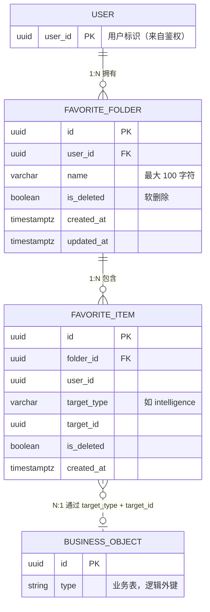

# 收藏夹模块设计文档

> **项目**：griver_favorites（独立新项目）  
> **架构参考**：DogeX GoldRiver 分层规范  
> **版本**：v1.0  
> **日期**：2026-07-27  
> **状态**：评审通过

---

## 1. 文档目的

本文档描述收藏夹（Favorite）模块的数据模型、API、分层架构、异常与日志规范，以及本期实现范围与后续扩展方向。编码前须通过设计评审。

---

## 2. 背景与目标

### 2.1 业务背景

用户需要将情报等内容收藏到自定义收藏夹中管理。若每种业务（文章、商品、视频等）各建一张收藏表，维护成本极高。企业级常见做法是 **通用收藏表 + `target_type` 区分业务对象**。

### 2.2 设计原则

- **通用收藏关系**：`favorite_item` 表通过 `target_type + target_id` 指向任意业务对象
- **收藏夹与元素多对多**：一个收藏夹可包含多个元素，一个元素通过中间表关联（后续扩展）
- **分层规范**：严格遵循 Gold River 架构（Router → Service → Repository），Session 由 Router 注入
- **YAGNI**：本期只做收藏夹本体 CRUD，添加/移除/移动、缓存、MQ 均不在本期范围

### 2.3 本期范围（强制）

| 功能 | 本期 |
|------|------|
| 收藏夹创建 | 是 |
| 收藏夹分页列表 | 是 |
| 收藏夹关键词搜索 | 是 |
| 收藏夹详情查询 | 是 |
| 收藏夹重命名 | 是 |
| 收藏夹软删除 | 是 |
| 软删后同名新建 | 是 |
| 添加/移除/移动情报 | 否，预留表结构与常量 |
| Cache-Aside 缓存 | 否 |
| RabbitMQ 操作日志 | 否 |

---

## 3. 数据模型

### 3.1 实体关系



说明：

- `favorite_item` 本期仅建表，API 后续实现。
- `BUSINESS_OBJECT` 表示 intelligence 等业务表，不建数据库级外键，通过 `target_type + target_id` 逻辑关联。

### 3.2 表：`favorite_folder`（本期实现）

| 字段 | 类型 | 约束 | 说明 |
|------|------|------|------|
| `id` | UUID | PK | 主键，建议 uuid7 |
| `user_id` | UUID | NOT NULL | 所属用户，来自鉴权，不信任请求体 |
| `name` | VARCHAR(100) | NOT NULL | 收藏夹名称，最大长度 **100** |
| `is_deleted` | BOOLEAN | NOT NULL, DEFAULT false | 软删除标记 |
| `created_at` | TIMESTAMPTZ | NOT NULL | 创建时间（UTC） |
| `updated_at` | TIMESTAMPTZ | NOT NULL | 更新时间（UTC） |

**索引与约束**：

```sql
-- 同用户、未删除的收藏夹名称唯一（软删后允许同名新建）
CREATE UNIQUE INDEX uq_favorite_folder_user_name_active
    ON favorite_folder (user_id, name)
    WHERE is_deleted = false;

-- 列表查询
CREATE INDEX idx_favorite_folder_user_list
    ON favorite_folder (user_id, is_deleted, updated_at DESC);
```

**命名规则**：

| 规则 | 说明 |
|------|------|
| 最大长度 | 100 字符 |
| 空名 | 不允许（trim 后长度须 ≥ 1） |
| 重名 | 同用户下，**未删除**的收藏夹不可重名 |
| 软删后同名 | **允许**新建同名收藏夹（新记录，新 id） |

### 3.3 表：`favorite_item`（预留扩展，本期不实现 API）

| 字段 | 类型 | 约束 | 说明 |
|------|------|------|------|
| `id` | UUID | PK | 主键 |
| `folder_id` | UUID | NOT NULL | 逻辑外键 → `favorite_folder.id` |
| `user_id` | UUID | NOT NULL | 冗余，便于按用户约束与查询 |
| `target_type` | VARCHAR(50) | NOT NULL | 收藏对象类型，见 `TargetType` |
| `target_id` | UUID | NOT NULL | 收藏对象 ID |
| `is_deleted` | BOOLEAN | NOT NULL, DEFAULT false | 软删除 |
| `created_at` | TIMESTAMPTZ | NOT NULL | 收藏时间 |

**预留约束（后续「添加收藏」任务启用）**：

```sql
-- 同一用户对同一对象全局只收藏一次（未删除）
CREATE UNIQUE INDEX uq_favorite_item_user_target_active
    ON favorite_item (user_id, target_type, target_id)
    WHERE is_deleted = false;

CREATE INDEX idx_favorite_item_folder
    ON favorite_item (folder_id, is_deleted);
```

> 若后续业务改为「同一对象可进多个收藏夹」，将唯一约束改为 `(folder_id, target_type, target_id) WHERE is_deleted = false`。

### 3.4 类型枚举 `TargetType`

定义于 `apps/favorite/common/constants.py`，本期仅声明，业务不使用：

| 值 | 说明 | 状态 |
|----|------|------|
| `intelligence` | 情报 | 预留 |
| （其他） | 实体、文章等 | 后续按需扩展 |

---

## 4. API 设计

**路由前缀**：`/grapi/v1/favorite`  
**模块注册**：`apps/favorite/__init__.py` → `on_init = routers.router`

### 4.1 接口总览

| # | 方法 | 路径 | 名称 | 鉴权 |
|---|------|------|------|------|
| 1 | POST | `/folders` | 创建收藏夹 | verify=True |
| 2 | GET | `/folders` | 分页列表 + 搜索 | verify=True |
| 3 | GET | `/folders/{folder_id}` | 收藏夹详情 | verify=True |
| 4 | PATCH | `/folders/{folder_id}` | 重命名 | verify=True |
| 5 | DELETE | `/folders/{folder_id}` | 软删除 | verify=True |

### 4.2 创建收藏夹

**`POST /grapi/v1/favorite/folders`**

请求体：

```json
{
  "name": "我的情报收藏"
}
```

| 字段 | 类型 | 必填 | 校验 |
|------|------|------|------|
| `name` | string | 是 | trim 后 1~100 字符 |

响应 `data`：

```json
{
  "id": "019fa2ff-xxxx-xxxx-xxxx-xxxxxxxxxxxx",
  "name": "我的情报收藏",
  "created_at": "2026-07-27T12:00:00+00:00",
  "updated_at": "2026-07-27T12:00:00+00:00"
}
```

业务规则：

- `user_id` 从 `request.user_id` 获取
- 同用户未删除重名 → `FavoriteFolderNameDuplicateException`

---

### 4.3 分页列表 + 搜索

**`GET /grapi/v1/favorite/folders`**

查询参数：

| 参数 | 类型 | 默认 | 说明 |
|------|------|------|------|
| `page` | int | 1 | 页码，≥ 1 |
| `page_size` / `size` | int | 10 | 每页条数，见 `settings` 上下限 |
| `keyword` | string | 可选 | 对 `name` 模糊匹配（ILIKE `%keyword%`） |

响应 `data`（`PaginatedResponse`）：

```json
{
  "items": [
    {
      "id": "...",
      "name": "我的情报收藏",
      "created_at": "...",
      "updated_at": "..."
    }
  ],
  "total": 1,
  "page": 1,
  "page_size": 10
}
```

业务规则：

- 仅返回 `user_id = 当前用户` 且 `is_deleted = false`
- 默认排序：`updated_at DESC`
- 不含收藏元素数量（后续扩展）

---

### 4.4 收藏夹详情

**`GET /grapi/v1/favorite/folders/{folder_id}`**

响应 `data`：

```json
{
  "id": "...",
  "name": "我的情报收藏",
  "created_at": "...",
  "updated_at": "..."
}
```

业务规则：

- 必须属于当前用户且 `is_deleted = false`
- 不存在 / 已软删 / 非本人 → 统一 `FavoriteFolderNotFoundException`（不泄露是否存在）

后续扩展：在此接口增加 `items` 或 `item_count` 字段，路由不变。

---

### 4.5 重命名

**`PATCH /grapi/v1/favorite/folders/{folder_id}`**

请求体：

```json
{
  "name": "新名称"
}
```

响应：返回更新后的对象（与创建出参结构相同），或 `data: {}`（实现时二选一，推荐返回更新后对象）。

业务规则：

- 名称校验同创建
- 不能与其他**未删除**收藏夹重名
- 更新 `updated_at`

---

### 4.6 软删除

**`DELETE /grapi/v1/favorite/folders/{folder_id}`**

响应：

```json
{
  "code": 0,
  "msg": "success",
  "data": {}
}
```

业务规则：

- 设置 `is_deleted = true`，更新 `updated_at`
- 不物理删除
- 软删后释放名称，允许同名新建

---

## 5. 工程结构

```
apps/favorite/
├── __init__.py
├── models.py
├── exceptions.py
├── common/constants.py
├── schemas/folder.py
├── repositories/folder.py
├── services/folder.py
└── routers/folder.py

tests/
├── unit/favorite/test_folder_service.py
└── integration/favorite/test_folder_router.py
```

---

## 6. 分层职责与 Session 传递

参照 Gold River `apps/relation/` 标准链路。

```
Depends(get_db_session())
  → Routers：注入 session，调用 Service，返回 APIResponse
  → Services：业务校验、commit、抛异常
  → Repositories：执行 SQL，接收 session，不 commit、不创建 session
```

### 6.1 Repository 函数命名

| 函数 | 职责 |
|------|------|
| `favorite_folder_create` | 构造 ORM 对象 |
| `favorite_folder_find_by_id_and_user` | 按 id + user_id 查未删记录 |
| `favorite_folder_list_by_user` | 分页 + keyword 列表 |
| `favorite_folder_count_by_name` | 同用户未删重名检查 |
| `favorite_folder_update_name` | 更新 name / updated_at |
| `favorite_folder_soft_delete` | 设置 is_deleted |

### 6.2 Service 函数命名

| 函数 | 职责 |
|------|------|
| `create_favorite_folder` | 创建 + 重名校验 + commit |
| `list_favorite_folders` | 分页列表 |
| `get_favorite_folder_detail` | 详情 + 归属校验 |
| `rename_favorite_folder` | 重命名 + commit |
| `delete_favorite_folder` | 软删 + commit |

### 6.3 Schema 命名

| 类型 | 名称 |
|------|------|
| 创建入参 | `FavoriteFolderCreateInSchema` |
| 更新入参 | `FavoriteFolderUpdateInSchema` |
| 列表查询 | `FavoriteFolderListQueryParams` |
| 出参 | `FavoriteFolderOutSchema` |

---

## 7. 统一响应格式

```json
{
  "code": 0,
  "msg": "success",
  "data": { ... }
}
```

- 业务失败：HTTP 200 + 非 0 `code`
- 分页：Service 返回 `PaginatedResponse`，Router 包 `APIResponse(data=...)`

---

## 8. 异常设计

| 异常类 | code 常量 | 触发场景 |
|--------|-----------|----------|
| `FavoriteFolderNotFoundException` | `CODE_FAVORITE_FOLDER_NOT_EXISTS` | 不存在、已软删或非本人 |
| `FavoriteFolderNameDuplicateException` | `CODE_FAVORITE_FOLDER_NAME_DUPLICATE` | 创建/重命名重名 |
| `FavoriteFolderNameInvalidException` | `CODE_FAVORITE_FOLDER_NAME_INVALID` | 空名、超 100 字符 |

Services 层抛出，Routers 不 try-catch。

---

## 9. 日志规范

| 级别 | 场景 | 关键字段 |
|------|------|----------|
| INFO | 创建/重命名/软删成功 | `user_id`, `folder_id`, `name` |
| WARNING | 业务异常 | `user_id`, 原因 |

Routers 层不写业务日志。

---

## 10. 测试设计（TDD）

| # | 用例 | 预期 |
|---|------|------|
| 1 | 创建成功 | 返回 folder |
| 2 | 创建空名/超 100 | NameInvalid |
| 3 | 创建重名 | Duplicate |
| 4 | 列表分页 | total/items 正确 |
| 5 | keyword 搜索 | 命中/未命中 |
| 6 | 详情成功 | 返回 folder |
| 7 | 详情不存在/已软删 | NotFound |
| 8 | 重命名成功/重名 | 成功 / Duplicate |
| 9 | 软删成功 | 列表不可见 |
| 10 | 软删后同名新建 | 成功，新 id |

---

## 11. 后续扩展（本期不实现）

| 能力 | 扩展方式 |
|------|----------|
| 添加情报 | `POST /folders/{folder_id}/items` |
| 移除收藏 | `DELETE /items/{item_id}` |
| 移动收藏 | `PUT /items/{item_id}/move` |
| 缓存 / MQ | 后续任务 |

---

## 12. 设计评审记录

| 日期 | 议题 | 结论 |
|------|------|------|
| 2026-07-27 | 通用表 vs 分表 | `target_type + target_id` |
| 2026-07-27 | 本期范围 | 仅 folder CRUD + 查询 |
| 2026-07-27 | 详情接口 | 必须实现 |
| 2026-07-27 | 名称长度 | 100 |
| 2026-07-27 | 软删后同名 | **允许** |

**评审状态**：已定稿
