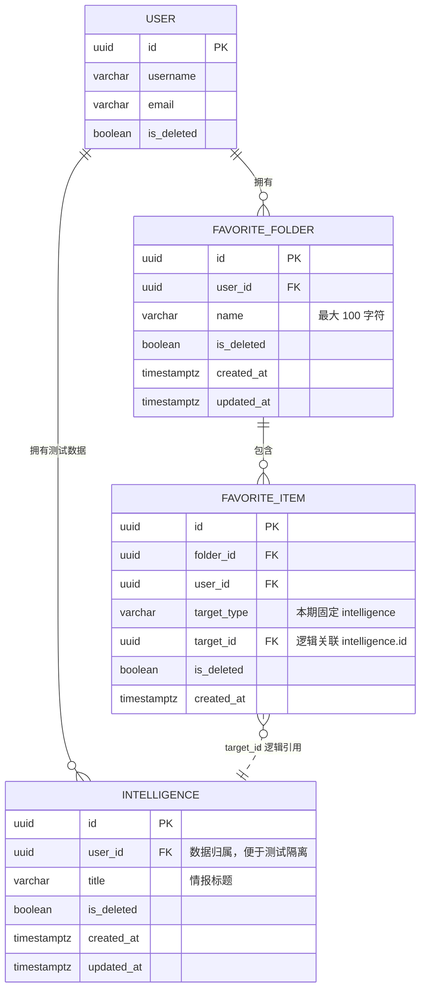
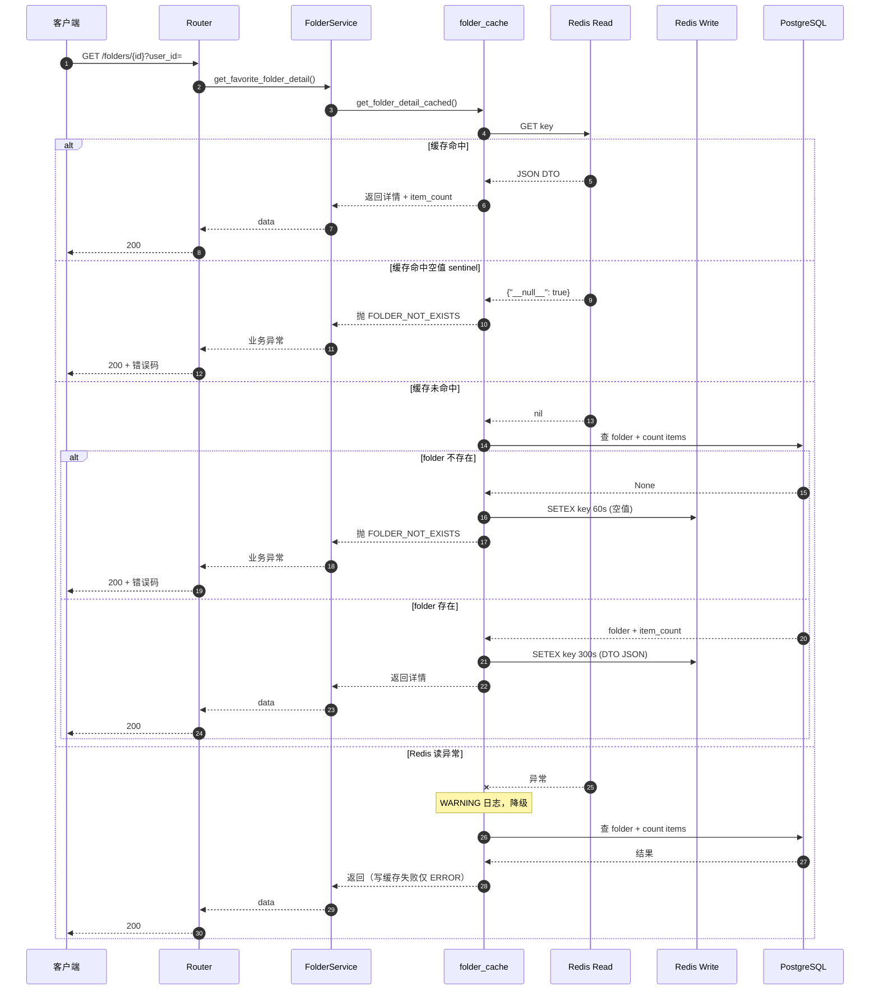
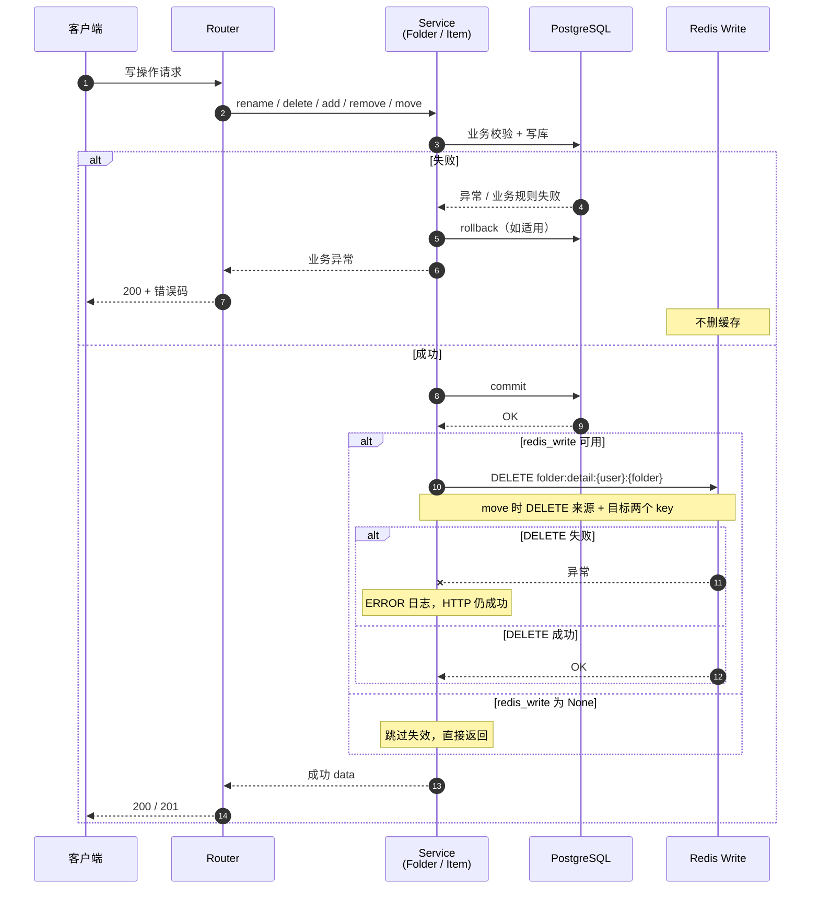
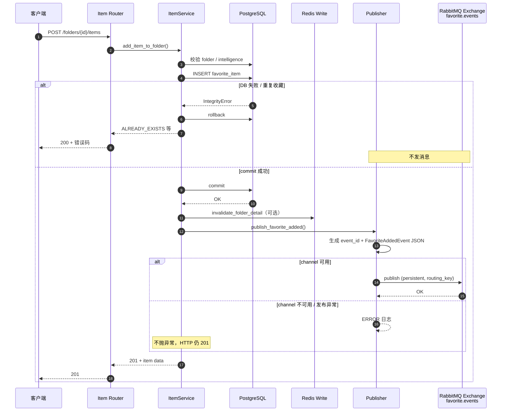
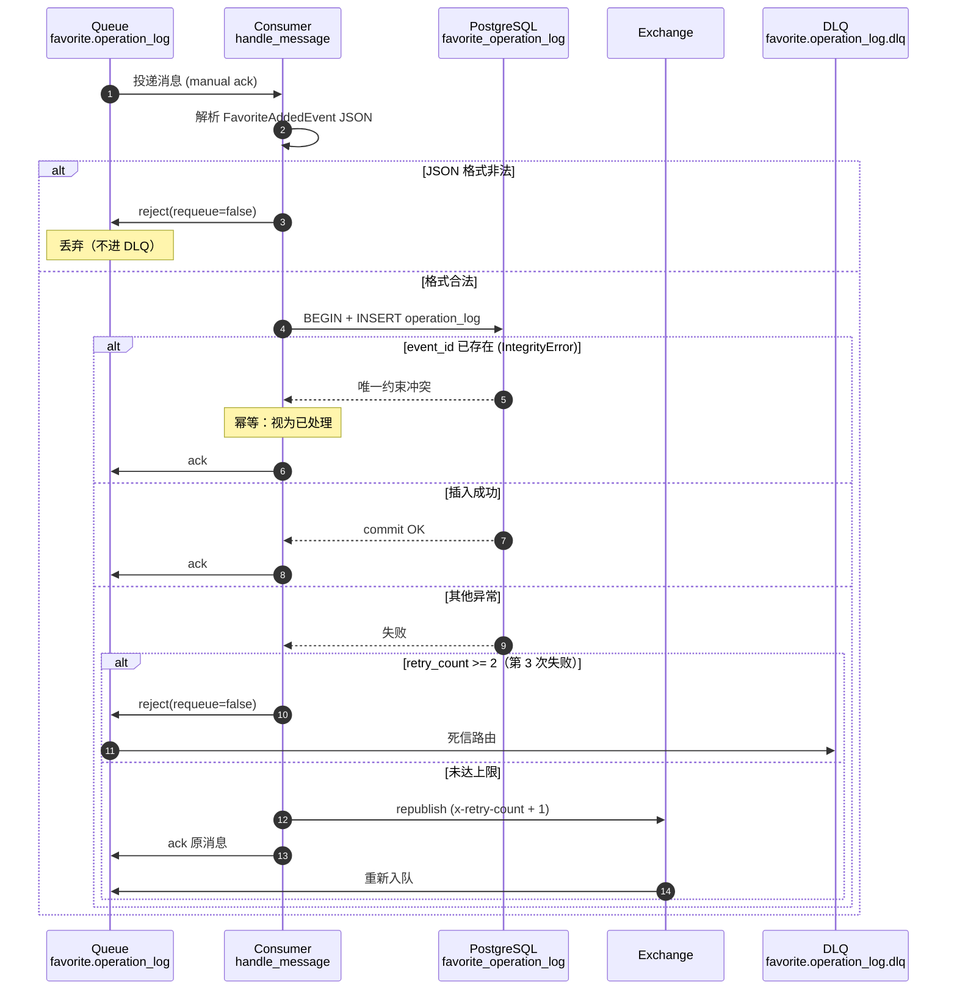

# 收藏夹模块设计文档

> **项目**：griver_favorites  
> **架构参考**：Router → Service → Repository 分层  
> **版本**：v3.4  
> **日期**：2026-08-01  
> **状态**：**已实现**（9 API + Redis Cache-Aside + RabbitMQ 操作日志 + Docker Compose；**101 passed**）

**关联文档**：[api.md](./api.md)（接口清单，错误码与本文档 §8 保持一致）

---

## 1. 文档目的

本文档描述收藏夹与收藏关系的数据模型、业务规则、API、分层架构、异常与测试设计，作为编码与 TDD 的唯一依据。

---

## 2. 背景与目标

### 2.1 业务背景

运营人员需要把**已有情报**整理到不同收藏夹中，方便后续查看和分类管理。

- 系统已存在情报基础数据；情报表**只供收藏与查询引用**。
- **本项目不实现**情报的新增、修改、删除。
- 须提供**可重复执行**的测试数据初始化方式（用户、情报、收藏夹、收藏关系）。
- **本项目不实现**：登录、权限、前端页面。
- **本项目必须实现**：Redis 缓存、RabbitMQ 收藏事件日志、Docker Compose 本地编排。

### 2.2 功能范围（全部本期实现）

| # | 功能 | 本期 |
|---|------|------|
| 1 | 创建、查询、重命名、软删除收藏夹 | 是 |
| 2 | 分页查询收藏夹，支持按名称搜索 | 是 |
| 3 | 查询收藏夹详情及其**情报数量** | 是 |
| 4 | 将指定情报加入收藏夹 | 是 |
| 5 | 将情报从收藏夹移除 | 是 |
| 6 | 将情报从一个收藏夹移动到另一个收藏夹 | 是 |
| 7 | 分页查询收藏夹内的情报 | 是 |
| 8 | 按情报**标题**筛选收藏内容 | 是 |
| 9 | 同一情报允许出现在**不同**收藏夹 | 是 |
| 10 | 删除收藏夹不删除原始情报数据 | 是 |

**明确不在本期**：登录鉴权、权限、前端。

**本期必须包含**：Redis Cache-Aside、RabbitMQ 操作日志、Docker Compose。

### 2.3 业务规则（强制）

| # | 规则 |
|---|------|
| R1 | 有效收藏夹名称不能重复；名称须 **strip 首尾空格** 后再校验 |
| R2 | 同一情报**不能重复加入同一个收藏夹** |
| R3 | 已删除的收藏夹不能查询、修改或继续添加情报 |
| R4 | 不存在或已删除的情报不能加入收藏夹 |
| R5 | 移动前必须校验**来源收藏夹确实包含**该情报 |
| R6 | **目标收藏夹已包含**该情报时，移动操作失败 |
| R7 | 移动操作必须在**同一事务**中完成，任一步失败全部回滚 |
| R8 | 删除收藏夹时同步处理有效收藏关系（级联软删 item），**不修改原始情报** |
| R9 | 并发重复收藏时，数据库层必须保证最终只有一条有效关系 |
| R10 | 所有异常须转换为**稳定的业务错误码**，禁止向客户端暴露原始数据库错误 |

### 2.4 设计原则

- **收藏夹与收藏关系 1:N**：一个收藏夹包含多条 `favorite_item`；每条 item 通过 `target_type + target_id` 指向情报。
- **跨收藏夹允许重复情报**：同一 `(target_type, target_id)` 可出现在多个收藏夹；**同一收藏夹内**不可重复（R2、R9）。
- **分层规范**：Router → Service → Repository；Session 由 Router 通过 `Depends(get_db_session)` 注入。
- **用户标识**：本项目无登录模块；`user_id` 由 API **请求体或 Query 显式传入**，用于数据隔离与测试。
- **情报只读**：Repository 只查询情报表校验存在性；不提供情报写接口。

### 2.5 非功能需求

| 项 | 约定 |
|----|------|
| 单用户收藏夹数量 | 暂不设上限 |
| 列表分页 | 默认 10，最大 100 |
| 时区 | TIMESTAMPTZ；API 出参 ISO 8601 UTC |
| 测试数据 | `scripts/db/` 提供 idempotent seed，可重复执行 |

---

## 3. 数据模型

### 3.1 实体关系



说明：

- `INTELLIGENCE` 为本项目**只读**测试/引用表；**`favorite_item.target_id` 不建物理 FK**，由 Service 校验（R4）。
- 同库强归属关系（`user_id`、`folder_id`）**不建物理 FK**，由 Service 层逻辑校验，策略详见 **§3.6**。
- 同一情报可被多个 folder 收藏；约束在 **folder 维度** 去重（§3.5）。

### 3.2 表：users

本地开发与测试用；`user_id` 由 API 传入，须存在于该表（或 seed 预置）。

| 字段 | 类型 | 约束 | 说明 |
|------|------|------|------|
| id | UUID | PK | |
| username | VARCHAR(64) | NOT NULL, UNIQUE | |
| email | VARCHAR(255) | NOT NULL, UNIQUE | |
| is_deleted | BOOLEAN | DEFAULT false | |
| created_at | TIMESTAMPTZ | NOT NULL | |
| updated_at | TIMESTAMPTZ | NOT NULL | |

### 3.3 表：intelligence（只读引用）

| 字段 | 类型 | 约束 | 说明 |
|------|------|------|------|
| id | UUID | PK | |
| user_id | UUID | NOT NULL, **逻辑引用** users.id | 测试数据归属；见 §3.6 |
| title | VARCHAR(255) | NOT NULL | 列表筛选字段（R8） |
| is_deleted | BOOLEAN | DEFAULT false | 已删不可收藏（R4） |
| created_at | TIMESTAMPTZ | NOT NULL | |
| updated_at | TIMESTAMPTZ | NOT NULL | |

**索引建议**：

```sql
CREATE INDEX idx_intelligence_user_active
    ON intelligence (user_id, is_deleted);

CREATE INDEX idx_intelligence_title
    ON intelligence (title);
```

### 3.4 表：griver_favorite_folder

| 字段 | 类型 | 约束 | 说明 |
|------|------|------|------|
| id | UUID | PK | |
| user_id | UUID | NOT NULL, **逻辑引用** users.id | API 传入；见 §3.6 |
| name | VARCHAR(100) | NOT NULL | strip 后 1~100 字符 |
| is_deleted | BOOLEAN | DEFAULT false | |
| created_at | TIMESTAMPTZ | NOT NULL | |
| updated_at | TIMESTAMPTZ | NOT NULL | |

**索引与约束**：

```sql
CREATE UNIQUE INDEX uq_griver_favorite_folder_user_name_active
    ON griver_favorite_folder (user_id, name)
    WHERE is_deleted = false;

CREATE INDEX idx_griver_favorite_folder_user_list
    ON griver_favorite_folder (user_id, is_deleted, updated_at DESC);
```

**命名规则**：同 v1.x——Unicode 计长、区分大小写、strip 后校验、软删后允许同名新建。

### 3.5 表：griver_favorite_item

| 字段 | 类型 | 约束 | 说明 |
|------|------|------|------|
| id | UUID | PK | |
| folder_id | UUID | NOT NULL, **逻辑引用** griver_favorite_folder.id | 见 §3.6 |
| user_id | UUID | NOT NULL, **逻辑引用** users.id | 冗余，便于按用户查询 |
| target_type | VARCHAR(50) | NOT NULL | 本期固定 `intelligence` |
| target_id | UUID | NOT NULL | **逻辑引用** intelligence.id（无物理 FK） |
| is_deleted | BOOLEAN | DEFAULT false | |
| created_at | TIMESTAMPTZ | NOT NULL | |

**索引与约束（对齐 R2、R9）**：

```sql
-- 同一收藏夹内同一情报仅一条有效记录（R2、R9）
CREATE UNIQUE INDEX uq_griver_favorite_item_folder_target_active
    ON griver_favorite_item (folder_id, target_type, target_id)
    WHERE is_deleted = false;

CREATE INDEX idx_griver_favorite_item_folder
    ON griver_favorite_item (folder_id, is_deleted);
```

> **与 v1.x 差异**：不再使用 `(user_id, target_type, target_id)` 唯一索引，否则违反「同一情报可进多个收藏夹」。

**软删 folder（R8）**：folder 软删时，其下未删 item **级联软删**；**不**修改 `intelligence` 表。

### 3.6 外键与引用完整性策略（审查说明）

> **结论**：本项目采用 **全逻辑外键**——同库表间归属与跨模块情报引用均在 **Service 层校验**；PostgreSQL **不**保留 `user_id` / `folder_id` 物理外键。  
> 迁移 `005_drop_physical_foreign_keys.py` 删除历史 FK；ORM `models.py` 无 `ForeignKey` 声明。

#### 3.6.1 策略总览

| 引用关系 | 物理 FK | Service 层校验 | 说明 |
|----------|---------|----------------|------|
| `griver_favorite_folder.user_id` → `users.id` | ✗ | `user_find_active_by_id`（create_folder） | 同库强归属 |
| `griver_favorite_item.folder_id` → `griver_favorite_folder.id` | ✗ | add/move/list 前查 folder（R3） | |
| `griver_favorite_item.user_id` → `users.id` | ✗ | `_ensure_user_exists` + folder 按 user 隔离 | |
| `intelligence.user_id` → `users.id` | ✗ | seed 预置用户 | 测试数据表 |
| `griver_favorite_item.target_id` → `intelligence.id` | ✗ | `intelligence_find_by_id_not_deleted`（R4） | 情报只读、跨模块引用 |

另：**部分唯一索引**（folder 名、folder 内 target）与 **软删** 规则仍由 PostgreSQL 保证，配合 R9 并发场景；`IntegrityError` 仅映射唯一索引冲突（R10），**不再**依赖 `*_fkey` 约束名。

#### 3.6.2 为何采用全逻辑外键

| 考量 | 说明 |
|------|------|
| 审查对齐 | 代码与文档一致：引用完整性显式落在 Service，便于审查逐条对照 R1–R10 |
| 写入路径 | 所有写入经 Service；create/add 前校验 user/folder/intelligence 存在且未删 |
| 并发兜底 | 唯一索引仍防 R1/R2/R9 竞态；非唯一类 IntegrityError → `INTERNAL_DATA_CONFLICT` |
| 历史迁移 | 001/003 曾建 FK；005 **upgrade** 统一 DROP，新环境 `001_favorite_schema.sql` 已无 `REFERENCES` |

#### 3.6.3 代码与 migration 对应

| 层级 | 路径 | 职责 |
|------|------|------|
| Migration | `005_drop_physical_foreign_keys.py` | DROP 四个物理 FK |
| ORM | `apps/favorite/models.py` | 所有 UUID 归属列**无** `ForeignKey` |
| Repository | `repositories/user.py` | `user_find_active_by_id` |
| Service | `services/folder.py`、`services/item.py` | 业务规则 R1–R8；commit 前校验 |
| 异常 | `common/integrity.py` + `exception_handlers.py` | 唯一约束 → 业务码；无 FK 分支 |

#### 3.6.4 审查话术（可直接使用）

> 收藏夹模块对**全部引用关系**使用逻辑外键：Service 在写入前校验 user / folder / intelligence；数据库保留部分唯一索引与软删规则作并发兜底；`IntegrityError` 经 R10 映射为稳定 API 错误码，不返回 DB 原文。物理 FK 已由 migration 005 移除，与 ORM、Service 实现一致。

### 3.7 类型枚举 TargetType

定义于 `apps/favorite/common/constants.py`：

| 值 | 说明 | 状态 |
|----|------|------|
| intelligence | 情报 | **本期唯一使用** |

### 3.8 数据库与迁移

| 项 | 约定 |
|----|------|
| 迁移工具 | Alembic |
| 迁移目录 | `migrations/versions/` |
| 本期建表 | users、griver_favorite_folder、griver_favorite_item、**intelligence** |
| 连接配置 | `.env` 中 `DATABASE_URL` / `DATABASE_URL_SYNC` |
| Seed | `scripts/db/` 下 SQL，须可重复执行（DELETE 固定 id 段 + INSERT） |

---

## 4. API 设计

**路由前缀**：`/grapi/v1/favorite`  
**模块注册**：`apps/favorite/__init__.py` → `on_init = routers.router`

**用户标识（无登录）**：除纯路径参数外，写操作与按用户隔离的读操作须在 **Body 或 Query** 传 `user_id`（UUID）。详见 [api.md](./api.md)。

### 4.1 接口总览

| # | 方法 | 路径 | 说明 | 成功 HTTP |
|---|------|------|------|-----------|
| 1 | POST | /folders | 创建收藏夹 | 201 |
| 2 | GET | /folders | 分页列表 + 名称搜索 | 200 |
| 3 | GET | /folders/{folder_id} | 详情 + **item_count** | 200 |
| 4 | PATCH | /folders/{folder_id} | 重命名 | 200 |
| 5 | DELETE | /folders/{folder_id} | 软删除（级联 item，不删情报） | 200 |
| 6 | POST | /folders/{folder_id}/items | 加入情报 | 201 |
| 7 | DELETE | /folders/{folder_id}/items/{item_id} | 移除情报 | 200 |
| 8 | PUT | /items/{item_id}/move | 移动到另一收藏夹 | 200 |
| 9 | GET | /folders/{folder_id}/items | 分页列表 + **标题筛选** | 200 |

业务错误：HTTP **200** + 非 0 `code`；参数错误：**422**。

### 4.2 创建收藏夹

**POST /folders**

请求体：

```json
{
  "user_id": "019fa2ff-user-xxxx-xxxx-xxxxxxxxxxxx",
  "name": "  我的情报收藏  "
}
```

| 字段 | 类型 | 必填 | 校验 |
|------|------|------|------|
| user_id | UUID | 是 | 须为有效用户 |
| name | string | 是 | strip 后 1~100 字符 |

响应 data（HTTP 201）：`id, name, created_at, updated_at`

规则：R1；重名 → `FAVORITE_FOLDER_NAME_DUPLICATE`

### 4.3 分页列表 + 搜索

**GET /folders?user_id=&page=1&size=10&keyword=**

| 参数 | 说明 |
|------|------|
| user_id | 必填 |
| page | 默认 1；小于 1 按 1 |
| size / page_size | 默认 10，最大 100；size 优先 |
| keyword | 对 folder.name ILIKE；空/空白视为未传 |

仅返回 `is_deleted = false`。排序 `updated_at DESC`。

### 4.4 收藏夹详情

**GET /folders/{folder_id}?user_id=**

响应 data 增加 **item_count**（未软删 item 数量）：

```json
{
  "id": "...",
  "name": "...",
  "item_count": 3,
  "created_at": "...",
  "updated_at": "..."
}
```

规则：R3；不存在/已软删/非本人 → `FAVORITE_FOLDER_NOT_EXISTS`

### 4.5 重命名 / 软删除

同 v1.x 语义；请求须带 `user_id`（Query 或 Body，与 api.md 一致）。

软删除：R3、R8——folder 与下属 item 软删，**intelligence 不变**。

### 4.6 加入情报

**POST /folders/{folder_id}/items**

```json
{
  "user_id": "...",
  "intelligence_id": "..."
}
```

等价于 `target_type=intelligence`，`target_id=intelligence_id`。

规则：

- R3：folder 须有效
- R4：情报须存在且 `is_deleted = false`
- R2、R9：同 folder 重复 → `FAVORITE_ITEM_ALREADY_EXISTS`；并发靠唯一索引 + 异常转换

### 4.7 移除情报

**DELETE /folders/{folder_id}/items/{item_id}?user_id=**

item 软删；不碰 intelligence。

### 4.8 移动情报

**PUT /items/{item_id}/move**

```json
{
  "user_id": "...",
  "target_folder_id": "..."
}
```

规则：R5 来源须包含；R6 目标不能已有；R7 **单事务**：软删来源关系 + 在目标新建（或更新）须在同一个 Service 事务中 commit。

失败时不应出现「来源已删、目标未加」的中间态。

### 4.9 收藏夹内情报列表

**GET /folders/{folder_id}/items?user_id=&page=1&size=10&keyword=**

| 参数 | 说明 |
|------|------|
| keyword | 对 **intelligence.title** ILIKE（R8） |

响应 items 元素建议：

```json
{
  "item_id": "...",
  "intelligence_id": "...",
  "title": "...",
  "created_at": "..."
}
```

---

## 5. 工程结构

```
apps/
├── core/
│   └── database.py              # engine、SessionLocal、get_db_session
└── favorite/
    ├── __init__.py              # on_init = routers.router
    ├── exceptions.py
    ├── dependencies.py          # get_folder_service、get_item_service
    ├── common/constants.py
    ├── schemas/
    │   ├── folder.py
    │   └── item.py
    ├── repositories/
    │   ├── folder.py
    │   ├── item.py
    │   └── intelligence.py      # 只读查询
    ├── services/
    │   ├── folder.py
    │   ├── item.py
    │   └── cache/
    │       └── folder_cache.py
    ├── mq/
    │   ├── publisher.py
    │   └── consumer.py
    └── routers/
        ├── __init__.py
        ├── folder.py
        └── item.py

apps/core/
    ├── database.py
    ├── redis.py              # 异步 Redis 读写客户端
    └── ...

migrations/versions/
scripts/db/
docker-compose.yml              # postgres + redis + rabbitmq（app 本机运行）
tests/
├── unit/favorite/
│   ├── test_folder_service.py      # 14
│   ├── test_item_service.py        # 14（含 MQ publish）
│   ├── test_folder_cache.py        # 8
│   ├── test_mq_publisher.py        # 3
│   ├── test_mq_consumer.py         # 8
│   ├── test_repo.py                # 23
│   └── test_routers.py             # 8
└── integration/favorite/
    ├── test_folder_router.py       # 10
    ├── test_item_router.py         # 8（含并发 R9）
    └── test_mq_favorite_add.py     # 5
```

---

## 6. 分层职责与 Session 传递

```
Depends(get_db_session)          # 注意：不加括号
  → Router：注入 session、调 Service、返回统一 JSON
  → Service：业务校验、事务 commit/rollback、抛业务异常
  → Repository：SQL/ORM，接收 session，不 commit
```

### 6.1 Repository 函数（与代码一致，均已实现）

| 模块 | 函数 | 说明 |
|------|------|------|
| folder | `favorite_create_folder` | 创建 |
| folder | `favorite_folder_find_by_id_and_user` | 按 id + user 查有效 folder |
| folder | `favorite_folder_count_by_name` | R1 重名校验 |
| folder | `favorite_folder_list_by_user` | 分页 + keyword |
| folder | `favorite_folder_count_items` | 详情 item_count |
| folder | `favorite_folder_update_name` | 重命名 |
| folder | `favorite_folder_soft_delete` | 软删 folder |
| folder | `favorite_item_soft_delete_by_folder_id` | R8 级联软删 item |
| item | `favorite_item_create` | 创建收藏关系 |
| item | `favorite_item_find_by_id_and_user` | 按 item id 查 |
| item | `favorite_item_find_in_folder` | R5/R6 移动校验 |
| item | `favorite_item_soft_delete` | 移除 |
| item | `favorite_item_list_by_folder` | 分页 + title keyword（JOIN intelligence） |
| intelligence | `intelligence_find_by_id_not_deleted` | R4 只读校验 |
| operation_log | `operation_log_create`、`operation_log_exists_by_event_id` | MQ 消费落库 + 幂等 |

### 6.2 Service 函数（均已实现）

| 模块 | 函数 | 说明 |
|------|------|------|
| folder | `create_folder` | R1；IntegrityError → DUPLICATE |
| folder | `list_favorite_folders` | 分页 + keyword |
| folder | `get_favorite_folder_detail` | 走 `get_folder_detail_cached`（Cache-Aside） |
| folder | `rename_favorite_folder` | 写后 `invalidate_folder_detail` |
| folder | `delete_favorite_folder` | R8 级联 + 缓存失效 |
| item | `add_item_to_folder` | R2/R4；commit 后 `publish_favorite_added` + 缓存失效 |
| item | `remove_item_from_folder` | 软删 + 缓存失效 |
| item | `move_item` | R5/R6/R7 单事务；双端缓存失效 |
| item | `list_items_in_folder` | 分页 + title keyword |
| cache | `get_folder_detail_cached` | 命中/未命中/空值 TTL/读降级 |
| cache | `invalidate_folder_detail` / `invalidate_folder_detail_many` | 写后失效 |

移动：`move_item` 内单事务 create + soft_delete，一次 commit；**commit 后**失效来源与目标 folder 缓存。

### 6.4 Redis 缓存（Cache-Aside）

**缓存范围**：仅 **收藏夹详情 + item_count**（GET `/folders/{folder_id}`）。

| 项 | 约定 |
|----|------|
| 键 | `folder:detail:{user_id}:{folder_id}` |
| 值 | JSON：`FolderDetailCacheDTO`（id, name, item_count, created_at, updated_at） |
| 正常 TTL | **300s**（5 分钟）；写操作主动 delete，TTL 仅作兜底 |
| 空值 TTL | **60s**；值为 sentinel `{"__null__": true}` 或专用常量 |
| 读客户端 | `redis_read`（`REDIS_READ_URL`） |
| 写客户端 | `redis_write`（`REDIS_WRITE_URL`）；本地可同 URL |
| 读失败 | 降级查 DB，打 WARNING/ERROR 日志 |
| 写/删失败 | 记录 ERROR，不静默 |

**失效时机**（`redis_write.delete(key)`）：

| 写操作 | 失效 key |
|--------|----------|
| rename_folder | 该 folder |
| delete_folder | 该 folder |
| add_item / remove_item | 该 folder |
| move_item | 来源 folder + 目标 folder |

**禁止**：直接 `pickle`/缓存 ORM 实例。

#### 6.4.1 读路径泳道图（Cache-Aside）

实现：`FolderService.get_favorite_folder_detail` → `get_folder_detail_cached`（`services/cache/folder_cache.py`）。



#### 6.4.2 写路径泳道图（写后失效）

写操作 commit **成功后**调用 `invalidate_folder_detail` 或 `invalidate_folder_detail_many`；失败或 rollback **不**删缓存。



### 6.5 RabbitMQ 收藏事件

**触发点**：`ItemService.add_item_to_folder` 在 **`await session.commit()` 成功之后**。

| 项 | 约定 |
|----|------|
| Exchange | `favorite.events` (topic) |
| Routing key | `favorite.item.added` |
| Queue | `favorite.operation_log` |
| DLQ | `favorite.operation_log.dlq` |
| 消息体 | `{ "event_id": UUID, "user_id", "folder_id", "intelligence_id", "action": "favorite_add", "occurred_at": ISO8601 }` |
| 幂等 | DB 表 `favorite_operation_log.event_id` UNIQUE |
| ACK | 消费成功手动 ack；失败 nack + 重试，**≥3 次**进 DLQ |
| MQ 不可用 | 收藏 HTTP 仍成功；publisher 打 ERROR 日志 |

**操作日志表**（migration 004）：见 requirements §6.5 H1。

#### 6.5.1 发布路径泳道图（HTTP 侧）

实现：`ItemService.add_item_to_folder` commit 后 → `publish_favorite_added`（`mq/publisher.py`）。



#### 6.5.2 消费路径泳道图（Consumer 独立进程）

实现：`python -m apps.favorite.mq.consumer` → `handle_message` → `process_favorite_added_message`（`mq/consumer.py`）。



#### 6.5.3 Redis 与 RabbitMQ 对照

| 维度 | Redis | RabbitMQ |
|------|-------|----------|
| 触发接口 | GET 详情读缓存；多种写操作失效 | 仅 POST add item |
| 与事务关系 | commit **后** delete key | commit **后** publish |
| 失败策略 | 读降级 DB；写删失败只打日志 | 发布失败 HTTP 仍 201；消费重试 3 次 → DLQ |
| 幂等 | 空值 sentinel 防穿透 | `event_id` UNIQUE |
| 进程 | 随 uvicorn lifespan | 独立 `python -m apps.favorite.mq.consumer` |

### 6.3 Schema 命名

| 类型 | 名称 |
|------|------|
| 创建 folder | FavoriteFolderCreateInSchema |
| 创建 item | FavoriteItemCreateInSchema |
| 移动 item | FavoriteItemMoveInSchema |
| folder 出参 | FavoriteFolderOutSchema（含 item_count） |
| item 出参 | FavoriteItemOutSchema |

---

## 7. 统一响应与 HTTP 约定

### 7.1 成功与业务失败

成功：

```json
{ "code": 0, "msg": "success", "data": {} }
```

业务失败：HTTP **200**，`code` 非 0，`msg` 为稳定字符串标识。

### 7.2 参数校验失败

| 场景 | HTTP |
|------|------|
| UUID 非法、字段缺失 | 422 |

### 7.3 HTTP 状态码汇总

| 接口类型 | 成功 | 业务错误 | 参数错误 |
|----------|------|----------|----------|
| POST 创建 | 201 | 200 | 422 |
| GET/PATCH/DELETE/PUT | 200 | 200 | 422 |

---

## 8. 异常设计

### 8.1 异常类与错误码

| 异常类 | msg 字符串 | 场景 |
|--------|------------|------|
| FavoriteFolderNotFoundException | FAVORITE_FOLDER_NOT_EXISTS | R3；不存在/已软删/非本人 |
| FavoriteFolderNameDuplicateException | FAVORITE_FOLDER_NAME_DUPLICATE | R1 |
| FavoriteFolderNameInvalidException | FAVORITE_FOLDER_NAME_INVALID | 空名、超长 |
| FavoriteItemNotFoundException | FAVORITE_ITEM_NOT_EXISTS | item 不存在或已软删 |
| FavoriteItemAlreadyExistsException | FAVORITE_ITEM_ALREADY_EXISTS | R2、R6 |
| IntelligenceNotFoundException | INTELLIGENCE_NOT_EXISTS | R4 |
| FavoriteItemMoveException | FAVORITE_ITEM_MOVE_FAILED | R5；来源不包含 |
| IntegrityError（捕获后转换） | 上述 DUPLICATE 等 | R9、R1；**禁止**透传 DB 原文（R10） |

### 8.2 异常处理职责

- Service 抛出业务异常；捕获 `IntegrityError` 并映射（R10）
- Router 不 try-catch 业务异常
- 全局 exception handler 映射为 HTTP 200 + code/msg

---

## 9. 日志规范

| 级别 | 场景 |
|------|------|
| INFO | folder/item 写操作成功 |
| WARNING | 业务异常 |
| ERROR | 未预期异常（不含直接返回给客户端的 DB 堆栈） |

---

## 10. 测试设计（TDD）

### 10.1 收藏夹用例

| # | 用例 | 预期 |
|---|------|------|
| 1~18 | 同 v1.x folder CRUD/分页/keyword/并发重名 | 见原清单 |

### 10.2 收藏关系用例

| # | 用例 | 预期 |
|---|------|------|
| 19 | 加入成功 | 201 |
| 20 | 同 folder 重复加入 | ALREADY_EXISTS |
| 21 | 不同 folder 加入同一情报 | 均成功 |
| 22 | 情报不存在/已删 | INTELLIGENCE_NOT_EXISTS |
| 23 | folder 已删后加入 | FOLDER_NOT_EXISTS |
| 24 | 移除成功 | item 软删，情报仍在 |
| 25 | 移动成功 | 来源无、目标有；单事务 |
| 26 | 来源不含情报 | MOVE_FAILED |
| 27 | 目标已含情报 | ALREADY_EXISTS |
| 28 | 列表按 title keyword | 命中/未命中 |
| 29 | 详情 item_count | 与 DB 一致 |
| 30 | 删 folder | item 级联软删，intelligence 不变 |
| 31 | 并发同 folder 重复加入 | 一条成功，其余 DUPLICATE |

### 10.3 Redis 缓存用例（必做）

| # | 用例 | 预期 |
|---|------|------|
| 32 | 缓存命中 | 不查 DB（mock repo 未调用） |
| 33 | 缓存未命中 | 查 DB 并回写 Redis |
| 34 | 空值缓存 | NotFound 后短 TTL 内不再打 DB |
| 35 | rename/delete/add/remove | 对应 key 被 delete |
| 36 | move | 来源+目标 key 均 delete |
| 37 | redis_read 异常 | 降级 DB，结果正确，有日志 |

### 10.4 RabbitMQ 用例（必做）

| # | 用例 | 预期 |
|---|------|------|
| 38 | 收藏成功 | 消息已发送 |
| 39 | DB 失败未 commit | 无消息 |
| 40 | consumer 消费 | operation_log 有记录 |
| 41 | 重复 event_id | 不重复插入 |
| 42 | 消费失败 3 次 | 进 DLQ |

### 10.5 测试环境约定

| 项 | 约定 |
|----|------|
| 单元测试 | mock Repository；覆盖 Service 规则 R1~R10 |
| 集成测试 | 测试库 + seed；`user_id` 由请求传入 |
| Router 测试 | `dependency_overrides` mock Service |
| 数据隔离 | 每用例独立 user_id 或固定 id 段清理后 seed |

**实现映射（2026-07-31）**：`pytest tests/ -q` → **101 passed**。§10.2 用例 19–31 → `test_item_service` + `test_item_router`；§10.3 用例 32–37 → `test_folder_cache`；§10.4 用例 38–42 → `test_mq_publisher` + `test_item_service` + `test_mq_consumer` + `test_mq_favorite_add`。

---

## 11. 测试数据初始化

| 脚本 | 说明 |
|------|------|
| `scripts/db/001_favorite_schema.sql` | 表结构参考（含 intelligence、folder 级 item 唯一索引） |
| `scripts/db/002_users_seed.sql` | 5 个测试用户 |
| `scripts/db/003_intelligence_seed.sql` | 情报测试数据（80 条，含 5 条已软删） |
| `scripts/db/004_favorite_seed.sql` | 15 folder + 105 item |

要求：

- 使用固定 UUID 段，执行前 DELETE 同段数据，保证**可重复执行**
- 执行顺序：`002` → `003` → `004`（需先 `alembic upgrade head`）

---

## 12. Docker Compose 与本地依赖

```yaml
# docker-compose.yml 包含（app 不在容器内，本机 uvicorn 启动）：
services:
  postgres:    # 5432
  redis:       # 6379
  rabbitmq:    # 5672, management 15672
```

环境变量见 `.env.example`：`DATABASE_URL`、`REDIS_READ_URL`、`REDIS_WRITE_URL`、`RABBITMQ_URL`。

**启动顺序**：

```bash
docker compose up -d
cp .env.example .env
alembic upgrade head          # 000–004
uvicorn main:app --reload     # HTTP API（lifespan 初始化 Redis / RabbitMQ）
python -m apps.favorite.mq.consumer   # 独立 Consumer 进程
```

Consumer 须单独进程运行（见 README）；Publisher 在 `ItemService.add_item_to_folder` commit 成功后异步发送。

---

## 13. 附录：GoldRiver 集成（可选，后期）

若将来并入 GoldRiver monorepo：

- `user_id` 改由 `request_init(verify=True)` 注入，从 Body/Query 移除
- `APIResponse` / 全局异常处理对齐宿主
- 路由注册方式 `on_init` 保持不变

---

## 14. 设计评审记录

| 日期 | 议题 | 结论 |
|------|------|------|
| 2026-07-31 | v3.1 实现终版 | 全量 API/Redis/MQ 已实现；101 passed；docker-compose 仅基础设施 |
| 2026-07-29 | v3.0 范围修正 | **纳入 Redis + RabbitMQ + Docker**；v2.0 错误排除已作废 |
| 2026-07-28 | v2.0 范围 | 完整 folder + item（曾错误排除 MQ/Redis） |
| 2026-07-28 | 去重维度 | folder 级唯一，允许跨 folder 重复同一情报 |
| 2026-07-28 | user_id | API 显式传入 |
| 2026-07-28 | 移动 | 单事务；R5/R6 校验 |
| 2026-07-28 | 删 folder | 级联 item，不删 intelligence |

**评审状态**：v3.1 已实现并对齐代码（完整作业范围）

---

## 15. 实现状态摘要

| 能力 | 状态 | 关键路径 |
|------|------|----------|
| 9 HTTP API | ✓ | `routers/folder.py`、`routers/item.py` |
| R1–R10 | ✓ | Service + DB 约束 |
| Redis Cache-Aside | ✓ | `folder_cache.py`；key `folder:detail:{user_id}:{folder_id}` |
| RabbitMQ 操作日志 | ✓ | `mq/publisher.py`、`mq/consumer.py`；migration 004 |
| Docker Compose | ✓ | PG + Redis + RabbitMQ |
| 自动化测试 | ✓ | 101 passed（`test_results.txt`） |

可选增强（非阻塞）：`/health` 探针、N+1 专项测、main.py MQ 优雅降级 — 见 requirements §3.2。

---

## 16. 文档变更记录

| 版本 | 日期 | 变更摘要 |
|------|------|----------|
| v3.4 | 2026-08-01 | **§3.6 全逻辑外键**：005 删物理 FK；Service + integrity.py 校验；文档与代码对齐 |
| v3.3 | 2026-08-01 | ~~§3.6 物理 FK~~（已由 v3.4 取代） |
| v3.2 | 2026-08-01 | §6.4.1/6.4.2 Redis 泳道图；§6.5.1/6.5.2 RabbitMQ 泳道图；§6.5.3 对照表 |
| v3.1 | 2026-07-31 | §6.1/6.2 全量实现；§10.5 测试映射；§12 Docker 无 app 容器；§15 实现状态 |
| v3.0 | 2026-07-29 | Redis/MQ/Docker 纳入范围；§6.1–6.2 对齐代码函数名 |
| v1.0 | 2026-07-27 | 初版 folder CRUD |
| v1.1 | 2026-07-28 | ER、错误码、HTTP 约定 |
| v1.2 | 2026-07-28 | RabbitMQ 模型草案 |
| v2.0 | 2026-07-28 | 完整 item API、R1~R10（曾误标不含 MQ/Redis） |
